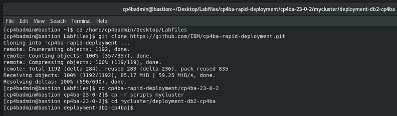
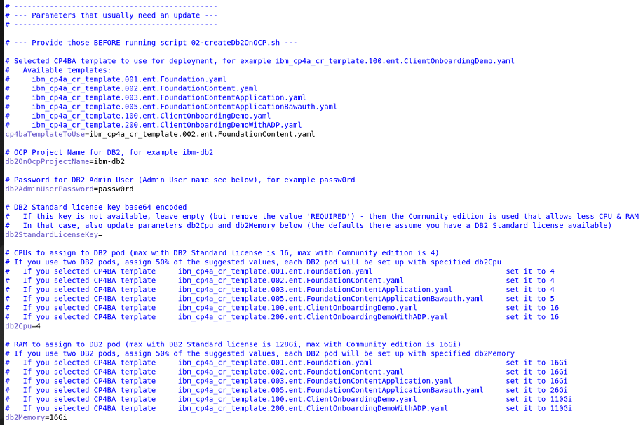

# Exercise 2: Deploy DB2

## 2.1 Introduction

A CP4BA production mode deployment requires you to provide the databases needed by the CP4BA components. In this exercise, you'll first deploy the DB2 Operator and containers on the OpenShift cluster. Other databases are also supported, for example, Oracle, SQL Server, or PostgreSQL. See Detailed system requirements: **https://www.ibm.com/docs/en/cloud-paks/cp-biz-automation/23.0.2?topic=pcmppd-system-requirements**

The database can run on OpenShift, but CP4BA also supports on-premises installations. We will be using OpenShfit to install the database.

In this exercise, you will run scripts to install DB2 Operator, and run the Operator to create a DB2 instance.

## 2.2 Exercise Instructions

1. On your bastion host use the Terminal to switch to a directory prepared for you to contain the rapid deployment and other scripts.
   
   ```sh
   cd /home/cp4badmin/Desktop/Labfiles
   ```
   
2. Clone the rapid deployment git repository onto your bastion host and copy the deployment scripts.
   
   **Note:** As part of this doc, we assume you copy the deployment scripts into directory **mycluster**. If you select a different directory, you must change some of the commands in the steps below; otherwise, you can copy/paste them as is.
   
   ```sh
   git clone https://github.com/IBM/cp4ba-rapid-deployment.git
   ```
   
   ```sh
   cd cp4ba-rapid-deployment/cp4ba-23-0-2
   ```
   
   ```sh
   cp -r scripts mycluster
   ```
   
   ```sh
   cd mycluster/deployment-db2-cp4ba
   ```
   
   Sample output of the previous commands:

   

3. Open the parameters file for DB2, 01-parametersForDb2OnOCP.sh, with gedit.
   
   ```sh
   gedit 01-parametersForDb2OnOCP.sh
   ```
   
4. Apply the following changes:
   
   - cp4baTemplateToUse – Name of CP4BA deployment template that will be used
     
     set the value to **ibm_cp4a_cr_template.002.ent.FoundationContent.yaml**
     
     **Notes:**
     
     The rapid deployment scripts provide multiple CP4BA templates from which you can choose. For example, this "FoundationContent" template deploys the foundation and the content patterns of CP4BA. Other templates deploy different patterns and thus can be used when other components are needed.
     
     The ClientOnboardingDemo pattern, for example, also deploys the Application, Decisions_ads, and Workflow patterns and brings with it most components needed to run the Client Onboarding Demo.
     
     Due to the available OpenShift cluster size, other templates can't be used for this bring-up Lab. Of course, if you later deploy on your own OCP cluster that provides more CPU and memory, you would also be able to deploy larger templates.
     
     The template name is important at this point as it defines the needed databases and the CPU and memory needed for the DB2 container. It also contains a definition of the databases that need to be generated by the scripts.
     
   - db2OnOcpProjectName – Project/namespace where DB2 should be installed, for example, ibm-db2 (you could specify any project name here, if that does not exist yet, it will be created by the scripts)
     
     set the value to **ibm-db2**
     
   - db2AdminUserPassword – Password that will be assigned to the db2 instance user.
     
     set the value to **passw0rd** (where the third-last character is a zero)
     
   - db2StandardLicenseKey – A DB2 Standard License key to assign to DB2 to allow for larger use of CPU and memory
     
     **remove the default value REQUIRED**, and leave this parameter empty
     
     **Note:** The CP4BA template you are deploying as part of this Lab requires three databases. DB2 community edition (installed when you don't specify a DB2 Standard License key) allows for enough CPU and memory for those three databases. Only when selecting a larger CP4BA template, would this key be needed.
     
   - db2Cpu – Number of CPUs for DB2 pod according to the selected CP4BA template
     
     set the value to **4**
     
   - db2Memory – Amount of memory for DB2 pod according to the selected CP4BA template
     
     set the value to **16Gi**
     
   - The changes you made so far should look as shown below.

     
     
   - Leave all other parameters at their default values
     
     > The storage class **nfs-client** available on your OpenShift cluster from TechZone is already referenced under property **db2OnOcpStorageClassName** as default value.
     
   - Finally, save your changes and close the editor.
   
5. Run script **02-createDb2OnOCP.sh**. This script will now install and configure DB2 for you based on the parameters previously specified in 01-parametersForDb2OnOCP.sh.
   
   ```sh
   ./02-createDb2OnOCP.sh
   ```
   
   **Notes:**
   
   To successfully run the script, you need the  jq tool and podman installed on your bastion host. For this Lab, these tools are already available on your bastion host.
   
   This script will prompt you for various input. Please have a look at the sample script output provided below to see the answers you must use.
   
   You need your Entitlement Registry key handy, see also **https://myibm.ibm.com/products-services/containerlibrary**.
   
   When you paste your Entitlement Registry key, it will not be shown; therefore, paste it just once and hit the Enter key.
   
   This script will exit if errors are hit during the installation.
   
   If you get the error message:
   ```
   error: unable to recognize "db2OperatorCatalog.yaml": Unauthorized
   ```
   Check whether you have successfully logged on to the OCP cluster on the command line.
   
   Sample script output:
   
   ```
   ./02-createDb2OnOCP.sh
   
   Found 01-parametersForDb2OnOCP.sh.  Reading in variables from that script.
     Reading 01-parametersForDb2OnOCP.sh ...
   Done!
   
   This script installs Db2u on OCP into project ibm-db2. For this, you need the jq tool installed and your Entitlement Registry key handy.
   
   
   Template ibm_cp4a_cr_template.002.ent.FoundationContent.yaml will be used
   The template requires  1 database instances. Each instance uses 4 cpus and 16Gi memory.
   
   Do you want to continue (Yes/No, default: No): Yes   <--- Enter Yes here
   
   Installing Db2U on OCP...
   
   Installing the DB2 Operator Catalog...
   catalogsource.operators.coreos.com/ibm-db2uoperator-catalog created
   
   Creating project ibm-db2...
   namespace/ibm-db2 created
   Now using project "ibm-db2" on server "https://api.ocp.ibm.edu:6443".
   
   Creating secret ibm-registry. For this, your Entitlement Registry key is needed.
   
   You can get the Entitlement Registry key from here: https://myibm.ibm.com/products-services/containerlibrary
   
   Enter your Entitlement Registry key: <paste your Entitlement Registry key here ONCE, it will not be shown, then hit the Enter key>
   Verifying the Entitlement Registry key...
   Login Succeeded!
   Entitlement Registry key is valid.
   secret/ibm-registry created
   
   Modifying the OpenShift Global Pull Secret (you need jq tool for that):
   secret/pull-secret data updated
   
   Creating Operator Group object for DB2 Operator
   operatorgroup.operators.coreos.com/ibm-db2-group created
   
   Creating Subscription object for DB2 Operator
   subscription.operators.coreos.com/db2u-operator created
   
   Waiting up to 5 minutes for DB2 Operator install plan to be generated.
   Mon Apr  1 07:00:00 CDT 2024
   
   Approving DB2 Operator install plan.
   installplan.operators.coreos.com/install-ggrgx patched
   
   Waiting up to 5 minutes for DB2 Operator to install.
   Mon Apr  1 07:01:00 CDT 2024
   
   Deploying the Db2u cluster.
   db2ucluster.db2u.databases.ibm.com/db2-inst1 created
   
   Waiting up to 15 minutes for c-db2-inst1-db2u statefulset to be created.
   Mon Apr  1 07:02:00 CDT 2024
   
   Patching db2-inst1-db2u statefulset.
   Skipped
   
   Waiting up to 30 minutes for db2-inst1-restore-morph job to complete successfully.
   Mon Apr  1 07:03:00 CDT 2024
   
   Updating number of databases allowed by DB2 installation from 8 to 30.
   configmap/c-db2-inst1-db2dbmconfig replaced
   
   Updating database manager running configuration.
   DB20000I  The UPDATE DATABASE MANAGER CONFIGURATION command completed 
   successfully.
   
   Restarting DB2 instance.
   Wolverine HA management state was disabled successfully.
   04/01/2024 07:04:00     0   0   SQL1064N  DB2STOP processing was successful.
   SQL1064N  DB2STOP processing was successful.
   04/01/2024 07:05:00     0   0   SQL1063N  DB2START processing was successful.
   SQL1063N  DB2START processing was successful.
   Wolverine HA management state was enabled successfully.
   
   *********************************************************************************
   ********* Installation and configuration of DB2 completed successfully! *********
   *********************************************************************************
   
   Removing BLUDB from DB2 instance 1
   DB20000I  The FORCE APPLICATION command completed successfully.
   DB21024I  This command is asynchronous and may not be effective immediately.
   
   DB20000I  The DEACTIVATE DATABASE command completed successfully.
   DB20000I  The DROP DATABASE command completed successfully.
   
   Existing databases on DB instance #1 are:
   
   Removing temporary files...
   Done.
   
   ***********************************************
   ********* DB2 Connection Information: *********
   ***********************************************
   
   Use this hostname/IP to access the databases e.g. with IBM Data Studio.
	   Hostname instance 1: router-default.apps.ocp.ibm.edu
	   Other possible addresses(If hostname not available above): 10.100.1.21,compute1.ocp.ibm.edu
   
   Use one of these NodePorts to access the databases e.g. with IBM Data Studio (usually the first one is for legacy-server (Db2 port 50000), the second for ssl-server (Db2 port 50001)).
   Instance 1: 
                   "nodePort": 30505,
                   "nodePort": 30107,
   
   Use "db2inst1" and password "passw0rd" to access the databases e.g. with IBM Data Studio.
   
   Db2u installation complete! Congratulations. Exiting...
   ```
   
6. While the script is running, you optionally can review the changes applied:
   
   a. First, the IBM DB2 Operator Catalog is deployed, see   db2OperatorCatalog.yaml   in folder   cp4ba-rapid-deployment/cp4ba-23-0-2/mycluster/deployment-db2-cp4ba   . An operator catalog gives you access to a set of operators, for example the D2 operator.
   
   b. A new project in OCP is created using a by the 02 script generated file named   db2-namespace.yaml   . This file gets generated from template file   db2-namespace.template.yaml   by injecting some of the parameters from   01-parametersForDb2OnOCP.sh   , for example parameter   db2OnOcpProjectName   that is set to value   ibm-db2   .
   
   c. A new secret is created in the new project using your Entitlement Registry key named   ibm-registry   .
      
      Note: A dummy email is used by the scripts.
   
   d. The OpenShift Global Pull Secret is modified to ensure you can pull the container images for DB2.
   
   e. An Operator Group object for DB2 Operator is created. The 02 script generated a file named   db2-operatorgroup.yaml   . This file gets generated from template file   db2-operatorgroup.template.yaml   by injecting some of the parameters from   01-parametersForDb2OnOCP.sh   .
   
   f. A Subscription for the DB2 Operator is created. The 02 script generated a file named   db2-subscription.yaml   . This file gets generated from template file   db2-subscription.template.yaml   by injecting some of the parameters from   01-parametersForDb2OnOCP.sh   . For example, the namespace (project name), channel and startingCSV are set.
      
      Applying this Subscription causes the DB2 operator to install. As you can see in the definition, installPlanApproval is set to Manual. This is to avoid DB2 operator to automatically update to latest version as this can cause issues while the DB2 instance deployment. Therefore, the script has to approve the first DB2 Operator install plan to allow the version provided under startingCSV to install. Install plans generated afterwards should not get approved by you manually to avoid issues while the creation of the DB2 instance.
   
   g. Once the DB2 Operator is installed, the script is deploying the Db2u cluster. For this, the 02 script generated a file named   db2.yaml   . This file gets generated from template file   db2.template.yaml   by injecting some of the parameters from   01-parametersForDb2OnOCP.sh   . For example, the namespace, license, admin user password and instance version are set.
      
      Applying this resource causes the Db2u cluster to be installed using the specified parameters.
      
      Between the applied files there are multiple dependencies, for example between DB2 Operator version installed (startingCSV) and Db2u cluster version installed. For example, newer DB2 Operators will not install older Db2u cluster versions and vice versa. Due to the rapid deployment scripts and the set of default values provided by them, beginners don’t need to care about such dependencies. Advanced users could modify these properties as well to deploy newer DB2 versions, for example also on a newer OpenShift version. But, in some cases changing the parameters in   01-parametersForDb2OnOCP.sh   is not sufficient, further changes in the .template. files will most likely be needed, too.

   h. Once the Db2u cluster is up and running, the 02 script waits till the job   c-db2ucluster-restore-morph   completes, which is the last step in deploying the cluster. Then, the script does also apply some further configuration changes to the Db2u cluster, performs a full re-start of DB2 and drops the default database BLUDB as this one is not needed for your CP4BA deployment. Last but not least some useful information is provided in case you want to connect to this DB2 cluster with for example IBM Data Studio.
   
7. Once the script completed, review the script output and ensure there are no errors, and that it is completed as shown in the sample script output.
   
   If you you have hit an issue and you don't know how to resolve it, please reach out to your hosting staff.
   
8. Look at the output of your script and verify that the deletion of BLUDB was successful. If this is not the case, delete it manually.

   Note: This database is created out of the box by DB2 but is not needed for the CP4BA deployment.
   
9. Run this command and verify that you see two completed pods and five pods Running and Ready (1/1).
   
   ```sh
   oc get pods
   ```

You have now successfully installed the DB2 Operator, and run the Operator to create a DB2 instance.

To continue, refer to **[Exercise 3: Create DB2 Databases](Exercise-3-Create-DB2-Databases.md)**.
