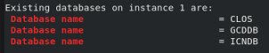
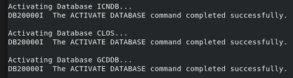

# Exercise 3: Create DB2 Databases

## 3.1 Introduction

A CP4BA production mode deployment requires you to provide the databases needed by the CP4BA components. In this exercise, you'll create the needed databases on the containerized DB2 you previously installed on the OpenShift cluster.

You will run a script provided by the rapid deployment scripts to create the needed databases. For the selected CP4BA deployment template - ibm_cp4a_cr_template.002.ent.FoundationContent.yaml - three databases will be required:
- ICNDB - database for Navigator
- GCDDB - database for Content Platform Engine
- CLOS - database for one CPE Object Store

## 3.2 Exercise Instructions

1. Run this command to verify you are still connected with OCP.
   
   ```sh
   oc version
   ```
   
   **Note:** If you are not connected to OCP, follow the instructions in **[Exercise 1: Prepare yourself for this Bring-Up Lab](Exercise-1-Prepare.md#123-access-the-openshift-tech-zone-envrioment)** to reconnect.
   
2. Make sure to be in the right directory.
   
   ```sh
   cd /home/cp4badmin/Desktop/Labfiles/cp4ba-rapid-deployment/cp4ba-23-0-2/mycluster/deployment-db2-cp4ba
   ```
   
3. Run script **03-createCp4baDBs4Db2OnOCP.sh** to create the databases needed for the CP4BA template that you selected.
   
   ```sh
   ./03-createCp4baDBs4Db2OnOCP.sh
   ```
   
   **Note:** You can ignore the following warning:
   ```
   SQL1363W  One or more of the parameters submitted for immediate modification were not changed dynamically.
   For these configuration parameters, the database must be shutdown and reactivated before the configuration
   parameter changes become effective.
   ```
   
5. Review the output of the script and make sure there were no errors and that the following three databases were created:

   
   
   **Note:** In case you got errors creating DBs, please use script 99-dropCp4baDBs4Db2OnOCP.sh to drop all DBs – then re-run script 03-createCp4baDBs4Db2OnOCP.sh. More databases will be created when selecting a larger CP4BA template for deployment.
   
6. Verify that the script also has activated these databases:

   

   **Note:** If you got errors activating DBs, please use script 04-activateDBs.sh to try to activate them again – if your DB2 pod got enough memory assigned according to the template used, activation of all DBs must be successful.

You have now successfully created all needed databases.

To continue, refer to **[Exercise 4: Deploy CP4BA Operator](Exercise-4-Deploy-CP4BA-Operator.md)**.
