# Exercise 4: Deploy CP4BA Operator

## 4.1 Introduction

To install the Cloud Pak 4 Business Automation, two modes are available. The **Starter** type deployment is useful for demonstrations, and includes the deployment of most prerequisites such as LDAP Server and databases. Tn this Lab guide however the **Production** deployment type is used instead, which can also be used for demonstrations, but also for deployments, which are used in production environments of customers. The procedure is described in the knowledge center in the "Installing Production Deployments" section, available from **https://www.ibm.com/docs/en/cloud-paks/cp-biz-automation/23.0.2?topic=installing-production-deployments**.

In Production deployments, separate installations of the databases and an LDAP server are needed. The LDAP server has been pre-installed in the lab environment used for this exercise, and the installation of the databases has been completed in previous exercises.

For the installation, the **case package** is used, which is available for download in Github. The case package is maintained by the IBM Product Development teams, and for every new ifix an updated script package is available. The links to the case packages can be found on the "Cloud Pak for Business Automation Interim fix download document", which is available from **https://www.ibm.com/support/pages/node/6576423**.

For the successful deployment of Cloud Pak for Business Automation, apart from Database and LDAP Server, storage volumes to store the persistent storage requests need to be created. While the required storage volumes can be created manually, if needed, in this Lab a Storage Class will be used, a suitable one has also been provided with the Lab environment, this is checked in one of the steps below.

For the main deployment of the CP4BA Operator, the documentation lists different possible solutions in the section "Setting up the cluster", available at **https://www.ibm.com/docs/en/cloud-paks/cp-biz-automation/23.0.2?topic=deployment-setting-up-cluster**. In this lab, the approach to "Setting up the cluster by running a script" is used, which performs the required steps for creating the project, setting up the operator user account, deploying the cert manager and license manager, creating the secret for accessing the container library and finally setting up the CP4BA Operators. Those steps can be done separately too, in case a customer requires it. The alternative would be a more graphical deployment through forms done on the OCP Administration GUI.

The exercise instructions in the following paragraph will guide you through the download and unpacking of the case package. Scripts available in the case package are then used to deploy the Cloud Pak for Business Automation operators, the Licensing Operator and the Certificate Manager Operator into the Openshift cluster. Correct installation is reviewed in the following section called "Verification instructions".

## 4.2 Exercise Instructions

1. Connect to your bastion host as documented in **[Exercise 1: Prepare yourself for this Bring-Up Lab](Exercise-1-Prepare.md#123-access-the-openshift-tech-zone-envrioment)**. Login as the **cp4badmin** user, if needed, the password is **passw0rd** (where the third-last character is a zero).
   
2. Open a Terminal, by clicking the link on the desktop. Switch to the Labfiles directory to host there the product deployment scripts.
   
   ```sh
   cd /home/cp4badmin/Desktop/Labfiles
   ```
   
3. Buy running the following commands, create a temporary directory, e.g., `/tmp`, download the CP4BA 23.0.2 IF002 Case package: **https://github.com/IBM/cloud-pak/raw/master/repo/case/ibm-cp-automation/5.1.2/ibm-cp-automation-5.1.2.tgz** into that temporary directory, and extract `ibm-cp-automation-5.1.2.tgz` into the same temporary directory.
   
   ```sh
   mkdir tmp
   ```
   
   ```sh
   cd tmp
   ```
   
   ```sh
   wget https://github.com/IBM/cloud-pak/raw/master/repo/case/ibm-cp-automation/5.1.2/ibm-cp-automation-5.1.2.tgz
   ```
   
   ```sh
   tar xvfz ibm-cp-automation-5.1.2.tgz
   ```
   
4. Extract the content of archive ibm-cp-automation/inventory/cp4aOperatorSdk/files/deploy/crs/cert-k8s-23.0.2.tar into the Labfiles directory, delete the temporary directory.
   
   ```sh
   cd ..
   ```
   
   ```sh
   tar xvf tmp/ibm-cp-automation/inventory/cp4aOperatorSdk/files/deploy/crs/cert-k8s-23.0.2.tar
   ```
   
   ```sh
   rm -r tmp
   ```
   
5. Change into the cert-kubernetes/scripts directory
   
   ```sh
   cd cert-kubernetes/scripts
   ```
   
6. Before running the script, make sure that you are connected through the oc CLI.
   
   ```sh
   oc version
   ```
   
   **Note:** If you are not connected to OCP, follow the instructions in **[Exercise 1: Prepare yourself for this Bring-Up Lab](Exercise-1-Prepare.md#123-access-the-openshift-tech-zone-envrioment)** to reconnect. 
   
7. Start the deployment of the CP4BA Operator by running the clusteradmin setup script.
   
   ```sh
   ./cp4a-clusteradmin-setup.sh
   ```
   
8. The script initially prompts you for some input. First, select the correct type of environment. This environment uses an Openshift-environment on Private Cloud that is not ROKS, so select **2**, and hit the Enter key.
   
   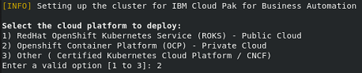
   
9. Next, select the type of deployment to do. In this lab we will create a Production type deployment, so select **2** again, and hit the Enter key.
   
   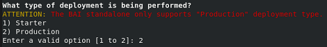
   
10. For the question whether to check the nodes if they are FIPS compliant, select **No**, and hit the Enter key.
    
11. For the question whether to use a private catalog select **No** as well, and hit the Enter key.
    
    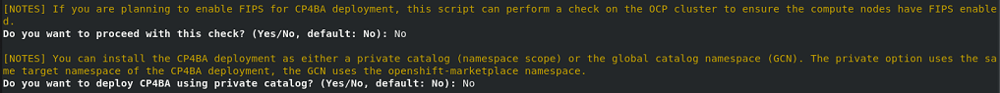
    
    **Note:** Private catalogs are recommended if you plan to deploy multiple Cloud Paks or multiple instances of the same Cloud Pak on the same OpenShift cluster. In such cases, private catlogs will allow you to individually upgrade the version of a deployment without any dependencies to the other deployments.
    
13. For the question, into which Openshift project the CP4BA should be deployed, answer **ibm-cp4ba**, and hit the Enter key.
    
    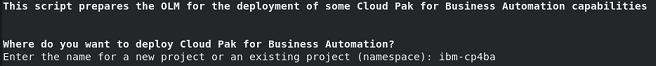
    
14. On the next question, a user needs to be selected. Select the user **ocpadmin** as well, by typing in the number, which is displayed in front of his name.
    
15. The next question is, if you have an entitlement key. Answer **Yes** and hit the Enter key.
    
16. Now the system is querying on the CP4BA Entitlement Registry key, paste your key **ONCE**. It will not be displayed. Then, hit the Enter key.
    
    **Notes:**
    
    You need your Entitlement Registry key handy, see also **https://myibm.ibm.com/products-services/containerlibrary**.
    
    When you paste your Entitlement Registry key, it will not be shown; therefore, paste it just once and hit the Enter key.
    
    At this point, no more questions need to be answered, and the script begins installation of the Cloud Pak for Business Automation Operator. It starts by installing the cert manager and the licensing manager, each into its own namespace. Then it installs the CP4BA Catalog Sources into the OCP cluster, then it installs the CP4BA Operator into the ibm-cp4ba project.
    
    The script can take between 15 minutes to half an hour to complete.
    
    **It might happen that the script times out when installing the licensing service. If this happens, re-run the cluster admin script, see step 7 and following above.**
    
    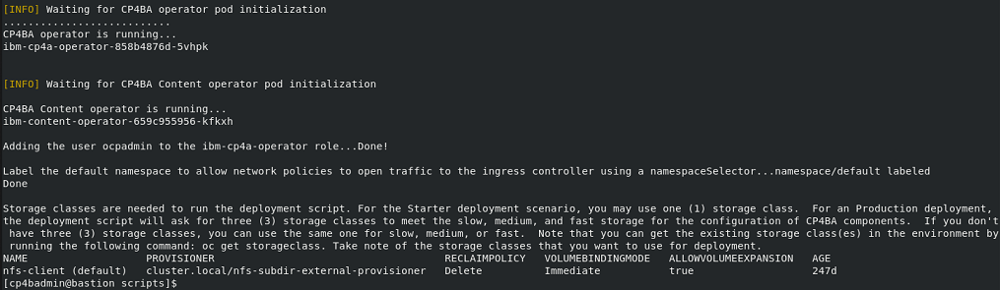

## 4.3 Verification Instructions

When the script finishes successfully, it should have installed the CP4BA Operators.

1. Change to Firefox, and login to the Openshift Web Console as **ocpadmin**, using password **passw0rd** (where the third-last character is a zero). To verify the operators' deployment, select the menu entry **Installed Operators** on the left-hand side within Operators, and change the project scope to ibm-cp4ba. Verify that the following seven operators show Status **Succeeded**.
   
   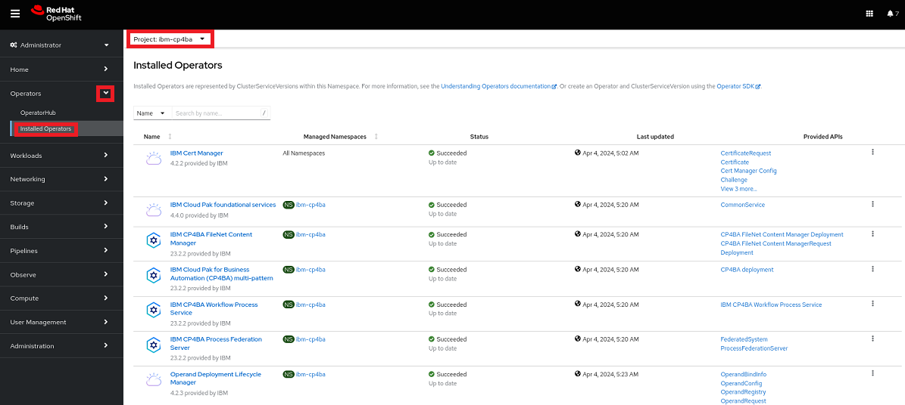

   > **Note:** In different CP4BA versions, you may see more or fewer operators.
   
2. At the top left side of the main pane, switch to project **ibm-licensing**. Verify that the following **two operators show Status Succeeded**.
   
   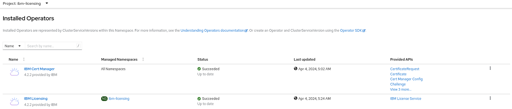
	
3. Change project to **ibm-cert-manager** and verify that the following operator shows Status **Succeeded**.
   
   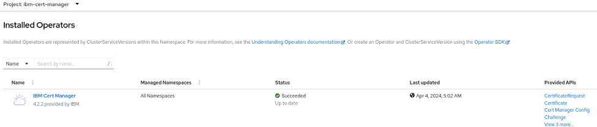
   
4. Select on the left-hand side within **Workloads** the menu entry **Pods**. Verify that you see four CertManager pods, all **Running and Ready (1/1)**.
   
   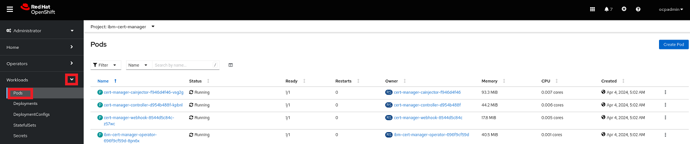
   
5. Switch to project **ibm-licensing**. Verify that you see two Licensing pods, all **Running and Ready (1/1)**.
   
   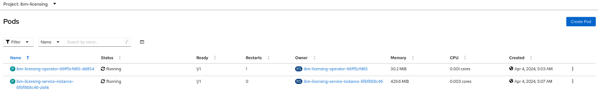
   
6. Finally, switch to project **ibm-cp4ba**. Verify that the following eleven pods exist, all **Running and Ready 1/1)**.
   
   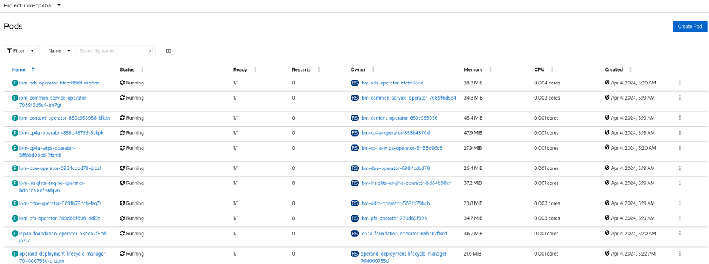
   
   > Note: In different CP4BA versions, You may see more pods.

Congratulations, the Cloud Pak for Business Automation operators, as well as the LicenseManager and CertManager operators seem to be installed properly.

Last but not least, let's deploy CP4BA in **[Exercise-5: Deploy CP4BA](Exercise-5-Deploy-CP4BA.md)**.
