# Exercise 5: Deploy CP4BA

## 5.1 Introduction

You have now completed **all prerequisites** for the CP4BA deployment: LDAP is installed on the bastion host, DB2 is deployed on the OpenShift cluster, and the needed databases are created. Also, the CP4BA Operators are deployed.

You are now ready to get started with the **deployment of the CP4BA Cluster**!

The first step is to verify **LDAP is running correctly**.

Then you have to **provide some more CP4BA-specific configuration parameters** and then you can **kick off the CP4BA deployment** using the CP4BA Operator.

Finally, there are some **post-deployment and verification steps** to verify that the deployment is healthy and that all deployed components are accessible.

## 5.2 Exercise Instructions

### 5.2.1 Deploy CP4BA

Follow these step-by-step instructions to deploy CP4BA using the rapid deployment scripts:

1. Connect to your bastion host as documented in **[Exercise 1: Prepare yourself for this Bring-Up Lab](Exercise-1-Prepare.md#123-access-the-openshift-tech-zone-envrioment)**. Login as the **cp4badmin** user, if needed, the password is **passw0rd** (where the third-last character is a zero).
   
2. Open a Terminal, by clicking the link on the desktop. Then, check that the Security Directory Server is running fine.
   
   ```sh
   systemctl status sds
   ```
   
   Expected output:
   
   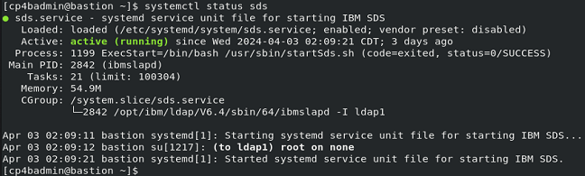
   
   If you don't see `Active: active (running)` use these commands to stop and start SDS:
   
   ```sh
   sudo systemctl stop sds
   ```
   
   ```sh
   sudo systemctl start sds
   ```
   
3. Run this command to verify you are still connected with OCP.
   
   ```sh
   oc version
   ```
   
   **Note:** If you are not connected to OCP, follow the instructions in **[Exercise 1: Prepare yourself for this Bring-Up Lab](Exercise-1-Prepare.md#123-access-the-openshift-tech-zone-envrioment)** to reconnect.
   
4. Switch to the directory where you previously downloaded the rapid deployment scripts into.
   
   ```sh
   cd /home/cp4badmin/Desktop/Labfiles/cp4ba-rapid-deployment/cp4ba-23-0-2/mycluster/deployment-db2-cp4ba
   ```
   
5. Open rapid deployment script 05-parametersForCp4ba.sh, with gedit.
   
   ```sh
   gedit 05-parametersForCp4ba.sh
   ```

6. Apply the following changes:
   
   - cp4baProjectName – Name of the project/namespace to use to deploy CP4BA, for example, ibm-cp4ba – make sure to use the same value as used before when running script `cp4a-clusteradmin-setup.sh`
     
     set the value to **ibm-cp4ba**
     
   - cp4baTlsSecretName – Parameter for ROKS deployments on IBM Cloud only – as you are not deploying on ROKS, leave empty
     
     **remove** the default value REQUIRED, and leave this parameter **empty**
     
   - cp4baAdminPassword – Use the password for user cp4badmin (this user was for you created in the LDAP server).
     
     set the value to **passw0rd** (where the third-last character is a zero)
     
   - ldapAdminPassword – Use the password that was specified for cn=root when setting up LDAP
     
     set the value to **passw0rd123** (where the sixth character is a zero)
     
   - ldapServer – The hostname or IP of the LDAP server
     
     set the value to **"10.100.1.8"**
     
   - The changes you made so far should look as shown below.
     
     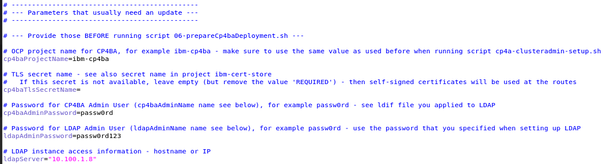
     
   - Leave all other properties at their default values
     
     > The storage class **nfs-client** available on your OpenShift cluster from TechZone is already referenced under properties named **cp4baScXXX** and **cp4baBlockScFast** as default value.
     
   - Save your changes and close the editor
   
7. Run script **07-createCp4baDeployment.sh**. This script will now deploy CP4BA using the parameters you previously provided in 01-parametersForDb2OnOCP.sh and 05-parametersForCp4ba.sh.
   
   ```sh
   ./07-createCp4baDeployment.sh
   ```
   
   **Notes:**
   
   This script will prompt you for various input. Please have a look at the sample script output provided below to see the answers you must use.
   
   You need your Entitlement Registry key handy, see also **https://myibm.ibm.com/products-services/containerlibrary**.
   
   When you paste your Entitlement Registry key, it will not be shown; therefore, paste it just once and hit the Enter key.
   
   Sample script output:
   
   ```
   ./07-createCp4baDeployment.sh
   
   Found 01-parametersForDb2OnOCP.sh.  Reading in variables from that script.
     Reading 01-parametersForDb2OnOCP.sh ...
   Done!
   
   Found 05-parametersForCp4ba.sh.  Reading in variables from that script.
     Reading 05-parametersForCp4ba.sh ...
     Extracting OCP Hostname
     OCPHostname set to apps.ocp.ibm.edu
   Done!
   
   Using correct cp4ba version.
   
   This script PREPARES and optionaly CREATES the CP4BA deployment using template ibm_cp4a_cr_template.002.ent.FoundationContent.yaml in project ibm-cp4ba. 
    
   Are 01-parametersForDb2OnOCP.sh and 05-parametersForCp4ba.sh up to date, and do you want to continue? (Yes/No, default: No): Yes   <--- Enter Yes here
   
   Preparing the CP4BA deployment...
   
   Switching to project ibm-cp4ba...
   Already on project "ibm-cp4ba" on server "https://api.ocp.ibm.edu:6443".
   
   Collecting information for secret ibm-entitlement-key. For this, your Entitlement Registry key is needed.
   
   You can get the Entitlement Registry key from here: https://myibm.ibm.com/products-services/containerlibrary
   
   Enter your Entitlement Registry key: <paste your Entitlement Registry key here ONCE, it will not be shown, then hit the Enter key>
   Verifying the Entitlement Registry key...
   Login Succeeded!
   Entitlement Registry key is valid.
   
   Deployment of CP4BA required synchronied clocks among the server nodes.
   Synchronize clocks now (y/n) ? n   <--- Enter n here
   Not synchronizing clocks...
   
   Preparing the CP4BA secrets...
   
   Preparing the CR YAML for deployment...
   
   All artefacts for deployment are prepared.
   
   Do you want to CREATE the CP4BA deployment in project ibm-cp4ba now? (Yes/No, default: No): Yes   <--- Enter Yes here
   
   Creating the CP4BA deployment...
   Creating secret ibm-entitlement-key in project ibm-cp4ba...
   Already exists
   Already on project "ibm-cp4ba" on server "https://api.ocp.ibm.edu:6443".
   
   Creating CP4BA secrets...
   secret/ldap-bind-secret created
   secret/icp4a-shared-encryption-key created
   secret/resource-registry-admin-secret created
   secret/ibm-ban-secret created
   secret/ibm-fncm-secret created
   secret/icp4adeploy-bas-admin-secret created
   secret/playback-server-admin-secret created
   secret/icp4adeploy-workspace-aae-app-engine-admin-secret created
   secret/ibm-adp-secret created
   secret/ibm-bawaut-server-db-secret created
   secret/ibm-pfs-admin-secret created
   secret/ibm-bawaut-admin-secret created
   secret/ibm-odm-db-secret created
   secret/ibm-ier-secret created
   Done.
   
   Creating the CP4BA deployment...
   icp4acluster.icp4a.ibm.com/icp4adeploy created
   Done.
   
   All changes got applied. Exiting...
   ```

### 5.2.2 CP4BA Deployment Verification

The deployment of CP4BA might take some time, **usually about one hour**.

You can monitor the progress of the deployment either through the OpenShift Web Console in the  Web Browser or by command line using the `oc get pods` command or monitor the Operator's logs to spot any potential issues.

This particular deployment is complete, when you see pod **icp4adeploy-navigator-watcher-xxxxx** in **Running** and **Ready (1/1)** state.

**Note:** As part of the CP4BA deployment, additional operators are added to project ibm-cp4ba.

1. In the OCP Web Console, change project to **ibm-cp4ba**.
   
   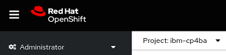
   
2. Once the deployment has finished, you should see 40 Running and Ready pods, and about 12 or 13 Completed pods, but **no Pending / CrashLoopBackOff pods**.
   
   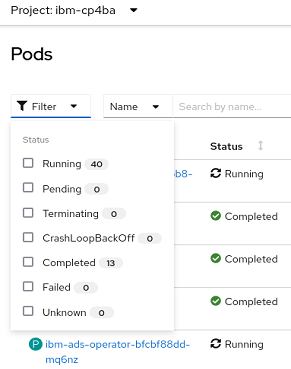
   
**Note:**
Some pods may be in Failed or Error state. For those, ensure another instance of that pod is in the Completed state. If this is the case, you can delete the Failed or Error pods. If there are pods in Failed or Error state where there is no other instance of that pod in a Completed state, the deployment is not healthy.

In different CP4BA versions, you may see more pods.

### 5.2.3 Post Deployment Steps - Enable log-in with the users from LDAP

1. Get the user ID and password of the zen admin user by running those two commands:
   
   ```sh
   oc get secret ibm-iam-bindinfo-platform-auth-idp-credentials -o jsonpath='{.data.admin_username}' | base64 -d && echo
   ```
   
   ```sh
   oc get secret ibm-iam-bindinfo-platform-auth-idp-credentials -o jsonpath='{.data.admin_password}' | base64 -d && echo
   ```
   
   **Note:** By default, the user id is **cpadmin**.
   
2. Switch to your Web Browser tab with the OCP Web Console and select **Networking >  Routes**.
   
3. If not on project **ibm-cp4ba**, switch to it.
   
4. In the **Location** column on the **cpd** Route, **click on the URL** to open the cpd route in a new tab.
   
   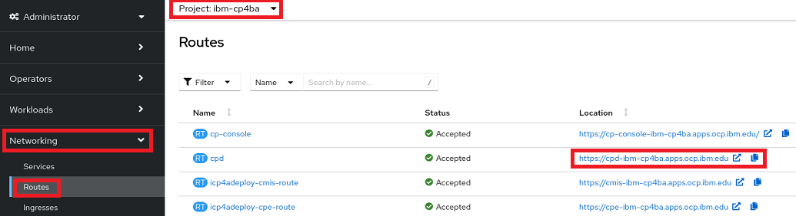
   
5. Accept the self-signed certificate.
   
   **Note:** For deploying the CP4BA Cluster, properly signed certificates can be created, which don't raise security exceptions in the Web Browser. This requires having SSL Certificates from a Certificate Authority, which would be available, for example, in an OCP environment on IBM Cloud.
   
6. On the Log in to IBM Cloud Pak screen, select **IBM-provided credentials (cpadmin only)**.
   
7. **Log in** using the zen admin user credentials you gathered in **Step 1**.
   
   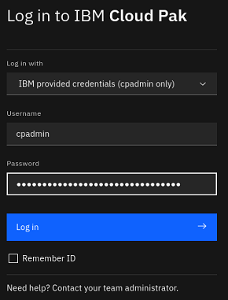
   
8. You now see the IBM Cloud Pak Welcome page. Click **Manage users**.
   
   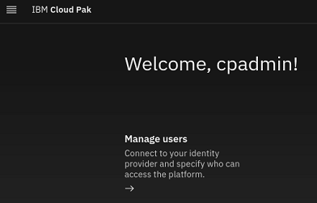
   
9. Select tab **User groups** and click **New user group**.
   
   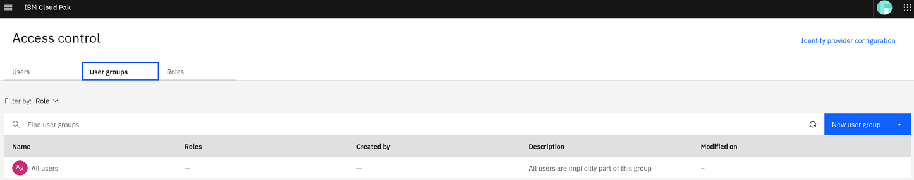
   
10. Enter the name **cp4bausers** and click **Next**.
    
11. On the **Users** page, select **Identity provider groups**, search for **cp4bausers**, **select the result** and click **Next**.
    
    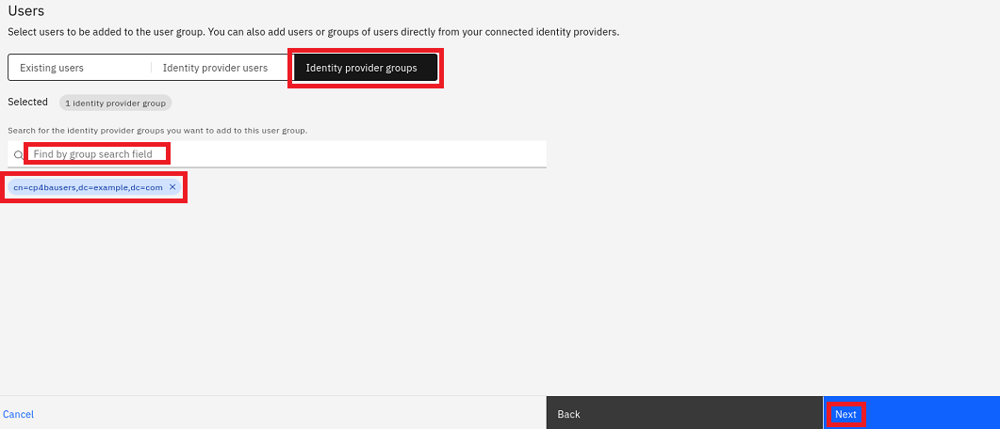
    
12. On the **Roles** page, select **Automation Developer** (needed for CP4BA, for example, to access BAStudio) and **User**, then click **Next**.
    
    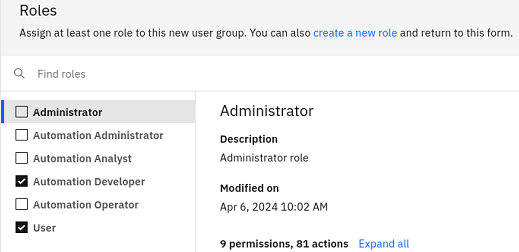
    
13. On the **Summary** page, review the selections and click **Create**.
    
14. Verify that the new group got created. Then, select the **Users** tab and click **cp4badmin**.
    
    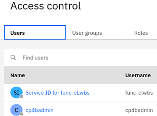
    
15. Click on **Assign roles**.
    
16. **Select all roles** and click **Assign 4 roles**.
    
    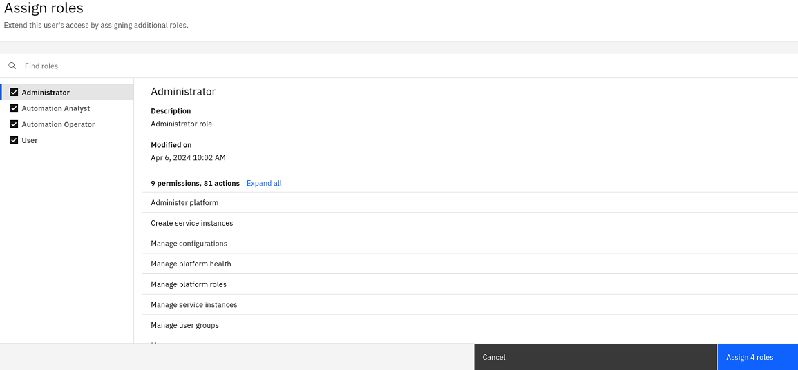
    
17. Verify the roles where assigned successfully. Then, log out with the zen admin user.

### 5.2.4 Post Deployment Steps - Verify that LDAP users can log in

1.	Click Log in.
   
2.	As **Log in with** option, select this time **Enterprise LDAP**.
   
3.	Log in with **cp4badmin**, a user from LDAP. The password is **passw0rd** (where the third-last character is a zero).
   
4.	Verify that cp4badmin now has full administrative access to zen - cp4badmin should also see the **Manage users** option, and in the **hamburger menu** the entry **Administration**.
   
  	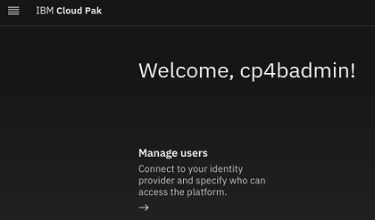 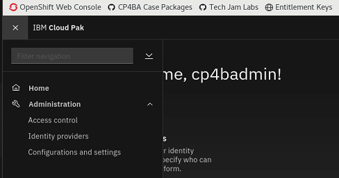
   
### 5.2.5 Post Deployment Steps - Verify that the deployed CP4BA components function correctly

In this chapter you will gather the cluster's URLs from config map **icp4adeploy-cp4ba-access-info** and test that all URLs work.

1.	Switch to the Browser tab with **OpenShift Web Console** open.
   
2.	Select **Workloads > ConfigMaps**.

3.	Search for **icp4adeploy-cp4ba-access-info**.
   
  	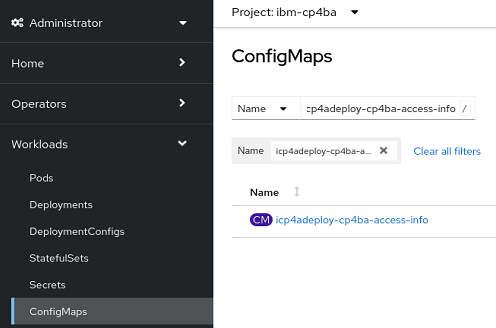
   
4. Click **icp4adeploy-cp4ba-access-info** to open this config map.
   
5. Scroll down to the **Data > cpe-access-info** section.
   
6. In a new Web Browser tab, open the URL for **Content Platform Engine administration**
   
   **Note:** As you are already logged in as cp4badmin, the ACCE will show up.
   
7. Expand **Object Stores** and verify **CONTENT** is available.
   
   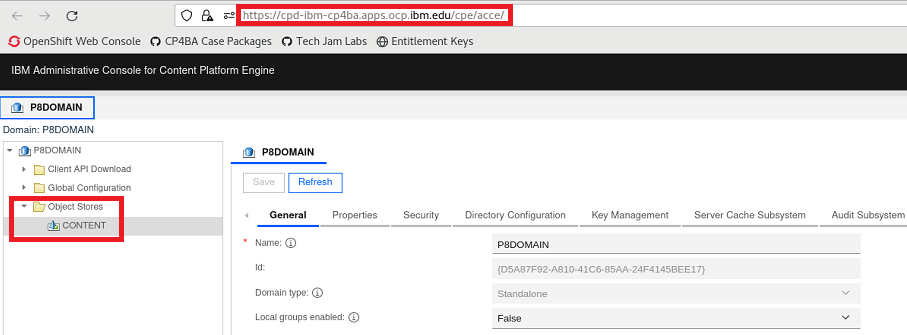
   
   **Note:** As part of the deployment it's possible to initialize the CPE domain and object stores. The selected template for deployment, creates P8DOMAIN and object store CONTENT.
   
8. Switch back to OpenShift Web Console tab where config map **icp4adeploy-cp4ba-access-info** is shown.
   
9. Locate **Business Automation Navigator for CP4BA** URL in the **navigator-access-info** section.
   
10. In a new Browser tab, open **Business Automation Navigator for CP4BA URL**.
    
    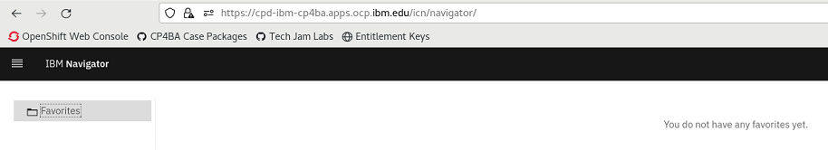
    
    **Note:** The hamburger menu provides you access to some other navigator desktops.
    
11. Similarly, verify the following two URL pages open correctly.
    
    - Content Management Interoperability Services for CP4BA (log in with cp4badmin / passw0rd, where the third-last character is a zero)
      
    - Content Services GraphQL

## 5.3 Summary

You have completed this exercise and learned how to leverage the CP4BA rapid deployment scripts to install CP4BA on an OCP cluster.

### 5.3.1 About CP4BA Rapid Deployment Scripts

The CP4BA rapid deployment scripts (https://github.com/IBM/cp4ba-rapid-deployment) are accessible by customers, business partners, and IBMers. The IBM Automation SWAT team continuously maintains them. Feel free to use them.

At the moment, only one template is available for CP4BA version 23.0.2, the one you used while this lab. Moving forward, more templates will get added to the rapid deployment scripts that allow you to rapidly install more CP4BA patterns.

Congratulations! You have now successfully installed IBM Cloud Pak for Business Autiomation version 23.0.2 IF002 on your OpenShift cluster using the rapid deployment scripts. With that, this lab is complete.

Now that you completed all exercises of this lab, you can do the [Quiz for Bring-up Lab 1](https://learn.ibm.com/course/view.php?id=11286) to earn the [Badge for Lab 1](https://www.credly.com/org/ibm/badge/ibm-cloud-pak-for-business-automation-installation-tech-jam).
