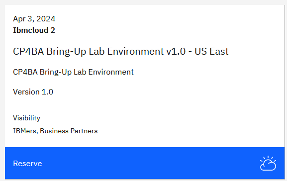
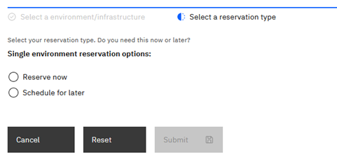
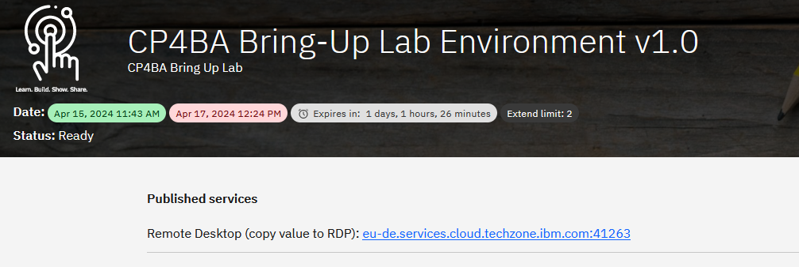
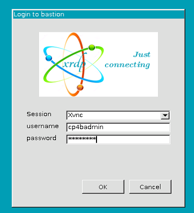
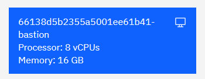
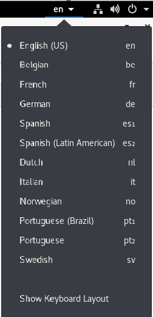

# Exercise 1: Prepare yourself for this Bring-Up Lab

## 1.1 Introduction

This exercise verifies that you have all prerequisites in place and instructs you how to reserve your lab environment. The lab environment 
consists of a Bastion Host VM and a Red Hat OpenShift Container Platform (OCP) Cluster with three master and three worker VMs.

### 1.1.1 Bastion Host VM

A **bastion** host is a computer from which you access the OpenShift cluster through the command line to administrate the OCP cluster. 
Administration of an OCP cluster also includes the configuration and installation of new software such as CP4BA. To do that, this Lab 
shows you how to use the scripts and information provided by the CP4BA development teams, by executing these scripts on the bastion host. 
Therefore, the bastion host must be one of RHEL, CentOS, or macOS. Finally, all commands these scripts need 
must also be available on the bastion host, for example, the OpenShift CLI, Kubernetes CLI, and so on.

The preparation of a bastion host is discussed in the documentation on this page: [Preparing a client to connect to the cluster](https://www.ibm.com/docs/en/cloud-paks/cp-biz-automation/23.0.2?topic=deployment-preparing-client-connect-cluster).

Other services are also deployed on this specific bastion host. The most important ones are the LDAP Server, which is used as the Authentication provider for the CP4BA deployment, and an NFS Server to provide persistent storage capabilities to the Openshift cluster.

### 1.1.2 Red Hat OpenShift Container Platform (OCP) Cluster VMs 

The OpenShift cluster was configured using OCP version 4.12.45. It will host the PostgreSQL and CP4BA containers which you will install 
later in this Lab. You can access your OCP cluster from the bastion host either by command line (oc command) or the OpenShift Web Console by Browser.

## 1.2 Exercise Instructions

Before you can start this Lab, you need the following prerequisites:
- an entitlement key, and
- an environment with a bastion host and OpenShift cluster from TechZone.

**Note:** All the tools such as podman and OpenShift command-line interface needed while the lab are already available on the provided bastion host.

### 1.2.1 Get the Entitlement Key

To complete this Lab, you must have an entitlement key with access to pull CP4BA images from the IBM Container Software Library `cp.icr.io`.

1. Check that you have an entitlement key with the proper image access. For this, please open [IBM Container Library](https://myibm.ibm.com/products-services/containerlibrary)
   and log in with your IBM ID. IBMers can use their w3 ID.

2. Then, switch to the Container software library page. IBMers and some Business Partners will see the following, which means that they do have 
   such an entitlement key available:

 

**Business Partners** that do not see **all** here, before proceeding, **must verify that CP4BA is listed on the Container software library page**. 
If you don’t see a CP4BA license listed, you can request here a CP4BA 60-day Trial license: https://www.ibm.com/account/reg/us-en/signup?formid=urx-44505. 
You cannot perform this bring-up Lab without a license and entitlement key.

### 1.2.2 Reserve the OpenShift Tech Zone Envrioment

1.	To get an OpenShift cluster from TechZone, access IBM Technology Zone: https://techzone.ibm.com/

2.	To sign-in, either use your IBM ID or your company credentials if SSO is set up between your company and IBM. For example, if you have an
    IBM W3 or IBM Partnerworld ID, you should use this ID.

    Note: Dependent on the IBM ID used to sign in, you may or may not be able to reserve a demo. If you can't reserve a demo with the current IBM ID, 
	check if you have another IBM ID that is enabled for IBM Technology Zone reservations. 

3.	Once signed in, open the lab resource page: https://techzone.ibm.com/collection/ibm-cloud-pak-for-business-automation-demos-and-labs-bring-up-lab

4.	Scroll down to the **Environments** section. Choose an environment with the highest version number. If you have multiple with the highest number, choose the one in the nearest geo. Then click on **Reserve**.

    

    Note: If you don't see the tile, go back to step 1 and sign in with a different ID.

5.	Select Reserve now. 

    
	
6.	On the next page, provide the necessary information: Provide the Purpose, e.g., "Practice / Self-Education", a description, select the geography 
    closest to your location and select the end time and date for the reservation. Plan for at least 8 hours, maybe more. Then click Submit.
	
	
	

7.	After you click Submit, you'll get some emails from IBM Technology Zone. Provisioning the environment will take about 75 minutes, then you should 
    get the second email informing you that your environment is Ready. 
	
	

In case there was an issue provisioning the environment, delete the reservation and try again later.

Once you get the email informing you that your environment is Ready, you can start your Lab.

### 1.2.3 Access the OpenShift Tech Zone Envrioment 

1.	On your local machine, click on **View My Reservations**. In the browser window, select the reservation for the Bring Up lab. 
 
2.  At the top of the reservation, you see a link to a Remote Desktop Service (RDP). Copy the link provided to the clipboard, and try running your 
    favorite Remote Desktop client with the RDP link. If that is working, its the preferred way to connect to the Bastion host of the Openshift environment.
	Should that not be possible, please skip to step xx.
	
	
	
3.  If the Remote Desktop connection can be used, the RDP login screen is shown. Login to the Bastion machine using the user account **cp4badmin** 
    and password **passw0rd** (where the third-last character is a zero). Skip to step 6.
	
	
	
	**Note:** Login is only possible either through RDP, or through the VM Remote Console (see below). You cannot use both methods at the same time, with the same user account.
	
4.	Should it not be possible to connect through RDP, then scroll down on the reservation, until you find the section with the title "VM Remote Console". 
	In the upper left corner you can find a blue tile. The first two lines contain the name of the machine. For the bastion host, it ends in "bastion".
	Click on it to open the remote console of the bastion host. 
	
	
	
	A window opens with the console window.
 
5.	Log-in to the desktop of the bastion host, by clicking on the **cp4badmin** user and using password  using **passw0rd** (where the third-last character is a zero).

    
	
	**Note:** If you see the current time and date after login, **press the Space key**. If the screen is blank, **move the mouse**. 

6.	Once you logged in, you see the **Red Hat Enterprise Linux (RHEL) Server desktop** of your bastion host. Ensure the **VM is connected** to the network 
    before proceeding. Check that the network icon in the top right corner shows connected. The environment is not usable if the VM is not correctly connected to the network. 

    Connected:  (if not connected that icon will not be shown)

7.  Open the Firefox by double clicking on the Firefox icon on the desktop. Use the link in the browser toolbar to navigate to the **Tech Jam Labs**. Open the lab instructions
	from inside the bastion host. This will allow you to copy&paste from the lab instructions much easier.
	
8.  If you are logged on using the "VM Remote Console" window, click **Full Screen** button in upper right corner. Notice that you can still switch to other windows using the 
    Alt-Tab keyboard combination from Windows clients.

	

9.	Change the size and resolution of the desktop to your liking. Open **Applications → System Tools → Settings**. Scroll down and click **Devices**. Change the **Display settings** to your liking. 
 
    
 
10.	Finally, to change the keyboard to your liking, this depends on weather you use RDP or VM Remote Console. On **VM Remote Console**, we recommend to leave the keyboard configured to **en**. 
    If possible, install on your local machine the US keyboard layout, switch to it, and use the US keyboard layout, while working with the Bastion host. When using **RDP**, it should be possible to adapt the keyboard layout of the Bastion host to the one you use on your your local machine instead.
	
	In any case, you can change the keyboard layout of the bastion host on the pull down menu in upper right corner. From there, you can also bring up a window showing you the current keyboard layout.
	
	
	
    To check that your keyboard works as expected, open Firefox and enter some special language characters in the URL field. 

10.	To access your OpenShift cluster through a Browser, **open Firefox** first (shortcut on the desktop).In Firefox, open bookmark **OpenShift Web Console**

    Note: In case you get the Warning: Potential Security Risk Ahead, click Advanced… and then click Accept the Risk and Continue. This is needed two times to finally get to the OCP log-in screen.
	
11.	Log in with **ocpadmin / passw0rd** (where the third-last character is a zero).

12.	Once logged in, verify that the OpenShift Web Console opens and that you have Administrator access.
 
    
	
13. When you check the status of the cluster, the Cluster and the Control Plane are green, but one Operator is degrated. By clicking on the link for **Operators** you can see that the machine-config operator is degraded. The reason is, that Updates of the Machine Config were disabled, before creating the copy of the OCP cluster.

	
 
13. In the navigation area, browse to **Compute**, and select **Machine Config Pools**. Note that Updates have been paused.
 
	
 
13. On both lines, **master** and **worker**, click on the three vertical dots menu, and select **Resume Updates**. The status will change to **Up To Date** or **Updating**. If it changes to **Updating**, await further status change to **Up To Date**. 

	
 
13.	Navigate back to **Overview** in the **Home** section of the navigation area. Check that the Status of **Cluster**, **Control Plane** and **Operators** is green, that should happen automatically after a while, after updates were resumed.
 
    
 
14.	On the Overview page, the main page, scroll down and verify that the Cluster inventory shows no errors.
 
    
	
    **Note:** The number of pods shown here could be different to what you will see. For Pods, you might see one pod in error and / or one to multiple progressing pods:
 
    
 
    The progressing icon should disappear automatically after a while.

15.	To get rid of the pods in error **click on the red icon** behind Pods. You’ll now see a list of pods that are in error, for example:
 
    
 
    If you only see such an **ip-reconciler** pod in the list, click the three dots at the end and delete that pod. In case of other **errors, warnings, or pending indicators**, 
	consult the Troubleshooting section to resolve those. 

16.	To log in through the oc command line interface, expand ocpadmin in the top right corner and select Copy login command.

    
 
17.	A new tab opens. Log in again with ocpadmin / passw0rd (where the third-last character is a zero) and select Display Token.

    
 
18.	Copy the entire oc login command to the clipboard.
 
    
 
19.	Open a Terminal window, paste the clipboard's content, and hit Enter.
 
    
 
20.	Next, run this command
 
    ```sh
    oc version
	```
	
    Expected output:
	
	
 
You have now successfully accessed and updated your environment and are ready to start the CP4BA deployment. 

To continue, refer to [Exercise 2: Deploy Operator](Exercise-2-Deploy-Operator.md).

