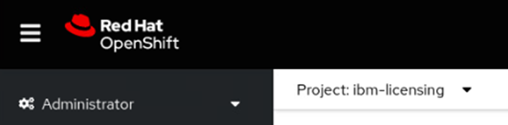
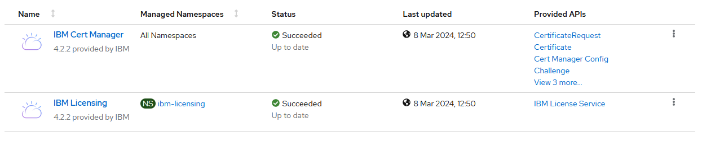
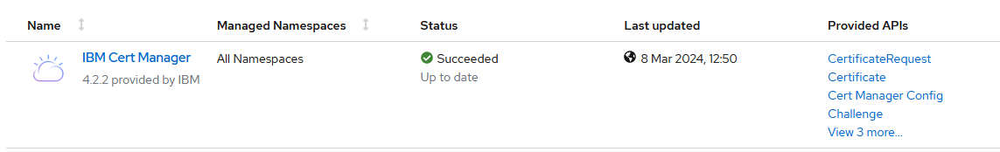
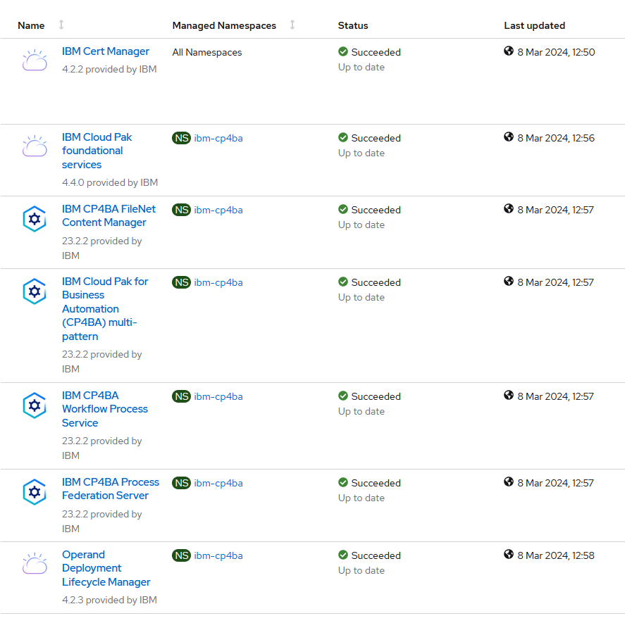

# Exercise 2: Deploy the CP4BA Operator

## 2.1 Introduction

To install the Cloud Pak 4 Business Automation, two modes are available. The **Starter** type deployment is useful for demonstrations, and includes the deployment of most prerequisites such as LDAP Server and databases. Tn this Lab guide however the **Production** deployment type is used instead, which can also be used for demonstrations, but also for deployments, which are used in production environments of customers. The procedure is described in the knowledge center in the "Installing Production Deployments" section, available from https://www.ibm.com/docs/en/cloud-paks/cp-biz-automation/23.0.2?topic=installing-production-deployments. 
 
In Production deployments, separate installations of the databases and an LDAP server are needed. The LDAP server has been pre-installed in the lab environment used for this exercise, and the installation of the databases will be done in a later exercise. Furthermore, Production type deployments also support Air-Gap installations, where Starter type deployments don't support Air-Gapped installations.

For the installation, the **case package** is used, which is available for download in Github. The case package is maintained by the IBM Product Development teams, and for every new ifix an updated script package is available. The links to the case packages can be found on the "Cloud Pak for Business Automation Interim fix download document", which is available from https://www.ibm.com/support/pages/node/6576423. 

For the successful deployment of Cloud Pak for Business Automation, apart from Database and LDAP Server, storage volumes to store the persistent storage requests need to be created. While the required storage volumes can be created manually, if needed, in this Lab a Storage Class will be used, a suitable one has also been provided with the Lab environment, this is checked in one of the steps below.

For the main deployment of the CP4BA Operator, the documentation lists different possible solutions in the section "Setting up the cluster", available at https://www.ibm.com/docs/en/cloud-paks/cp-biz-automation/23.0.2?topic=deployment-setting-up-cluster. In this lab, the approach to "Setting up the cluster by running a script" is used, which performs the required steps for creating the project, setting up the operator user account, deploying the cert manager and license manager, creating the secret for accessing the container library and finally setting up the CP4BA Operators. Those steps can be done separately too, in case a customer requires it. The alternative would be a more graphical deployment through forms done on the OCP Administration GUI.

> **Note about Air-Gap deployments**: This refers to the installation of Cloud Pak 4 Business Automation in environments, which have no access to "the internet", and thus cannot use the IBM Container Library and other Container registries directly for deployment. The CP4BA Version 23.0.2 now supports version 3.0 of the Air-Gap, through deployment of an addon to the Openshift commandline program "oc".

> In Air-Gap deployments, usually a local registry is used, and images from the IBM Container library are copied into that local registry. Furthermore, Openshift is configured by using an Image Content Source Policy, to search the local registry whenever specific images (specified through their SHA256) are referenced from the IBM Container library.

> When copying of the images to the local registry and setup of the Image Content Source Policy hav completed successfully, deployment of an Air-Gapped environment can be done exactly like a regular, non air-gapped one.

The exercise instructions in the following paragraph will guide you through the download and unpacking of the case package. Scripts available in the case package are then used to deploy the Cloud Pak 4 Business Automation operators, the Licensing Operator and the Certificate Manager Operator into the Openshift cluster. Correct installation is reviewed in the following section called "Verification instructions".

## 2.2 Exercise Instructions

1.	Click on the tile for the Bastion host. Login as the "cp4badmin" user, if needed, the password is "passw0rd" with a zero.

2.	Open a Terminal, by clicking the link on the desktop. Create a directory to host the product deployment scripts. 
    ```sh
    mkdir cp4ba
    ```
	
3.	Open Firefox through clicking on the link on the desktop. Find the link for **CP4BA Case Packages** in the Bookmark toolbar, and navigate to it. The **Case Package** Directory for the Cloud Pak For Business Automation can be found here: https://github.com/IBM/cloud-pak/tree/master/repo/case/ibm-cp-automation. The document **index.yaml** contains a mapping of directory names to CP4BA Version numbers.  Click it to determine the directory for the **Version 23.0.2**. (There might be a typo on the version number.)

4.	Click the back arrow, and navigate to the folder named "5.1.0". In the folder click the "ibm-cp-automation-5.1.0.tgz" file.

5.	Click the download arrow on the file to store it in the Downloads folder.

    

6.	Back on the terminal window, navigate to the cp4ba directory, and unpack the case package.
    ```sh
    cd cp4ba
    tar xvfz ../Downloads/ibm-cp-automation-5.1.0.tgz
    ```
	
7.	The case package contains a tar file containing the actual deployment scripts. Unpack that file in current directory. First search it:
    ```sh
    find . -name \*.tar
	```
	
8.	Copy & Paste the returned filename into the tar command:
    ```sh
    tar xvf (filename)
	```
    Expected output:
	
 
9.	Change into the cert-kubernetes/scripts directory
    ```sh
    cd cert-kubernetes/scripts
	```
	
10. Before the operator can be deployed, a connection to the OCP cluster must be established. If you did the previous exercise immediately before this one, the connection should still be valid, nothing needs to be done. If not, use **Firefox** to login to the OCP Console application, then generate a login command, and paste it into the Terminal window, as shown in the last exercise.

14.	Verify, that on openshift a storage class has been created.
    ```sh
    oc get storageclasses
	```
	Expected output:
		
 
15.	Verify, that the ocpadmin user has indeed clusteradmin privileges. 
    ```sh
    oc auth can-i create project
	````
	Expected output:
    
 
16.	Start the deployment of the CP4BA Operator by running the clusteradmin setup script.
    ```sh
    ./cp4a-clusteradmin-setup.sh
	````
	
17.	Select the correct type of environment, when the script asks for it. This environment uses an Openshift-environment on Private Cloud that is not ROKS, so select **2**

    
 
18.	Select the type of deployment to do. In this lab we will create a Production type deployment, so select **2** again.

    
 
19.	For the question whether to check the nodes if they are FIPS compliant, select **no**.

20.	For the question whether to use a private catalog to support air-gap deployments select **no** as well.

21.	For the question, into which Openshift project the CP4BA should be deployed, answer **ibm-cp4ba**.

    
 
22.	On the next question, a user needs to be selected  . Select the user **ocpadmin** as well, by typing in the number, which is displayed in front of his name. 

23.	When the system is querying on the CP4BA Entitlement Registry key, copy the displayed link into the clipboard. Then select the **Firefox** browser and open the link in a new tab. On the page of the Knowledge Center, click on the link to **My IBM Container Software Library**. 

    **Note:** To avoid entering your credentials to the IBM Container Library in the bastion host, you can also do this on your local machine, and copy over the entitlement key to the bastion host using the Clipboard.

24.	After logging in to your IBM account, please verify that you have access to "Cloud Pak 4 Business Automation" software, by clicking the "Container software library" entry on the left side. Then select the "Entitlement keys" entry on the left side, and copy one of the still valid entitlement keys to the clipboard.

25.	Back on the Terminal window answer **Yes** to the question whether you have an entitlement registry key. Then paste the key from the clipboard, when prompted.

    
 
At this point, no more questions need to be answered, and the script begins installation of the Cloud Pak 4 Business Automation Operator. It starts by installing the cert manager and the licensing manager, each into its own namespace. Then it installs the CP4BA Catalog Sources into the OCP cluster, followed by installing the CP4BA Operator into the ibm-cp4ba project. 

The script can take between 15 minutes to half an hour to complete.

**Note:** If deployment of the cert manager and/or licensing manager take longer than expected, it might be that the `cp4a-clusteradmin-setup script.sh` script is aborted with an error message. In this situation it can help to await the existance of running instances of the cert manager and/or license manager , and then re-run the `cp4a-clusteradmin-setup script.sh`. The script will detect existing deployments of the cert manager and/or license manager and skip deployment of already deployed components.

## 2.3 Verification Instructions

When the script finishes, it should have installed the CP4BA Operators. 

**Note:** The version numbers will show up differently as indicated in the screenshots, as the screenshots were made with a newer IFIX release.

1.	Change to Firefox, and login to the Openshift Web Console as ocpadmin, using password passw0rd, with a zero. To verify the operators' deployment, select the menu entry **Installed Operators** on the left-hand side within Operators.
    
	
 
2.	At the top left side of the main pane, switch to project **ibm-licensing**.

    
 
3.	Verify that the following **two operators show Status Succeeded**.
 
    
	
	
4.	Change project to **ibm-cert-manager**.
 
    
	
5.	Verify that the following operator shows Status **Succeeded**.
 
    
	
6.	Change project to **ibm-cp4ba**.
  
    
	
 
7.	Verify that the following seven operators show Status **Succeeded**.
 
    
	
    > *Note:* In different CP4BA versions, you may see more or fewer operators.

8.	Select on the left-hand side within **Workloads** the menu entry **Pods**.
 
    
 
9.	Verify that the following 11 pods exist, all **Running and Ready 1/1)**.

    
 
    > Note: In different CP4BA versions, You may see more pods.

Congratulations, the Cloud Pak 4 business automation operators, as well as the LicenseManager and CertManager operators seem to be installed properly. So lets continue with preparation steps for the CP4BA deployment. Refer to [Exercise 3: Prepare Deployment](Exercise-3-Prepare-Deployment.md) for details.
