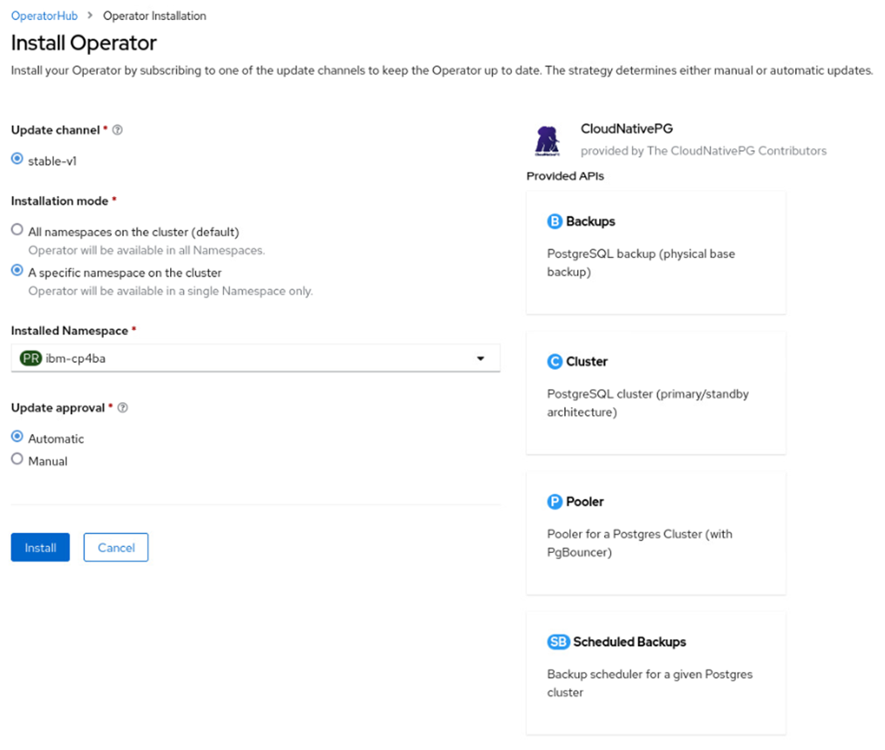
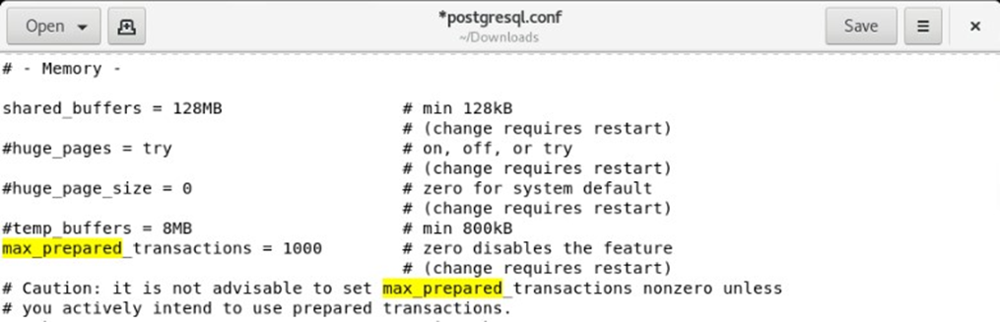
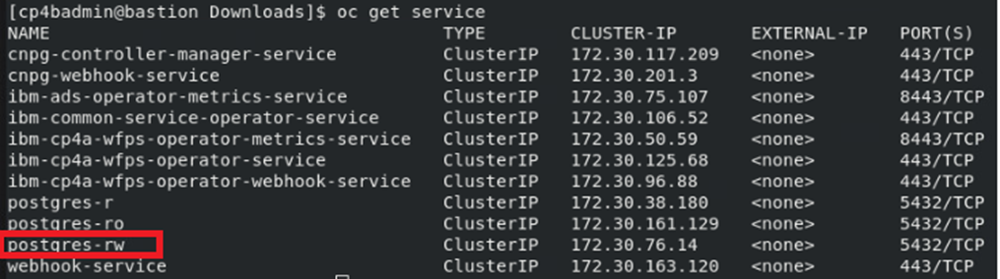
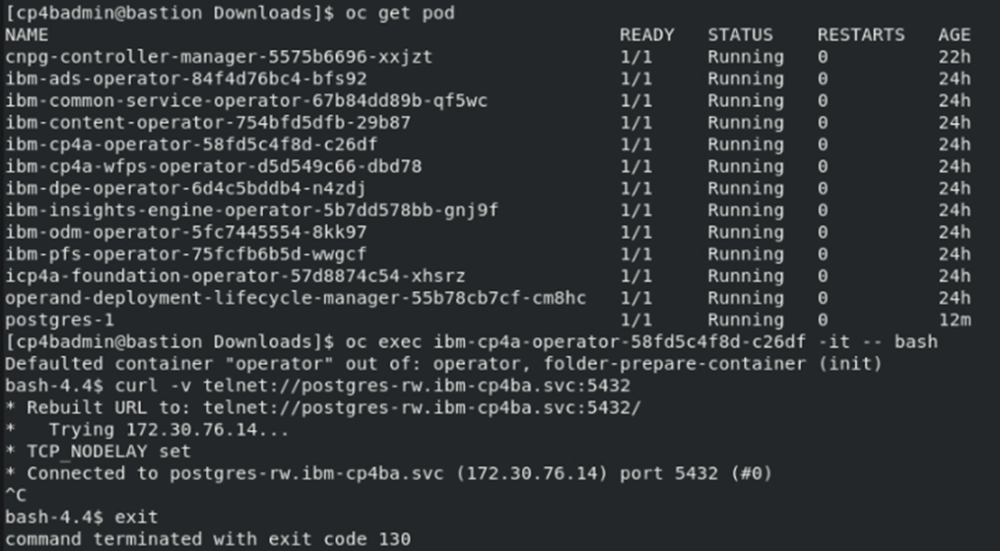

# Exercise 4: Deploy PostgreSQL

# 4.1 Introduction

In this section, the PostgreSQL database will be deployed, and the database related property files of the CP4BA deployment updated with required configuration values. 
For the deployment of the PostgreSQL database, the Cloud Native PG Postgres operator will be used. The Cloud Native PG Postgres Operator is an open source initiative, 
its homepage can be found on https://cloudnative-pg.io/. The operator supports Openshift as well as plain Kubernetes, so called *CNCF* deployments. For commercial usage, 
with needed software support, there exist commercial products derived from the offering from Cloud Native PG.

# 4.2 Exercise Instructions

1.	Switch to the **Terminal** window. Change to the cert-kubernetes/scripts directory.

    ```
    cd $HOME/cp4ba/cert-kubernetes/scripts
    ```

2.	Review the database property files, to determine further information about required databases.

    ```
    gedit cp4ba-prerequisites/propertyfile/cp4ba_db_name_user.property
    ```
	
4.	The file lists 4 databases, one for the GCD of the FileNet installation, two more for the two object stores, and one for Content Navigator. Close the gedit window again.

5.	Switch to **Firefox** and select or open a tab with the **Openshift Web Console**. Login as **ocpadmin** with password passw0rd, if required. Note that the third-last character in the password is a zero. Then select in the menu **OperatorHub** from the **Operator** menu

    
 
6.	On the right side, enter **postgres** in the search prompt, and click on the **CloudNativePG** tile. The CloudNativePG operator can also be used with plain Kubernetes deployments, it does not depend on Openshift.

    

7.	If you want, read through the text which comes. Information from that page will not be included in any badge questions.  When ready, click on **Install**

    

8.	Select to install the operator in a specific project / namespace, and select the **ibm-cp4ba** namespace for it. Then click on **Install**.

    

9.	Click on **Installed Operators** to review the deployment of the Operator. When it is ready, the operator should have Status **Succeeded**. 

    
	
	**Note:** The version number can differ from the one in the screenshot, as the CloudNativePG operator is upgraded regularly.

10.	Select the **Workflow -> Pods** menu. The operator pod is named cnpg-controller-manager. Check that the operator pod for the CloudNativePG is running.

    
 
11.	Open a new tab in Firefox and navigate to the [LabData/postgres.yaml](LabData/postgres.yaml) file. Download the file **postgres.yaml** to the lab environment. To do that, with the content of the postgres.yaml file displayed in the Github window, right-click on the "Raw" link above and save the link to file.

    

12.	Change to the Terminal window. Change to the **Downloads** folder, then check and apply the **postgres.yaml** file

    ```
    cd
    cd Downloads
	gedit postgres.yaml
    oc apply -f postgres.yaml
    ```
	
	No changes are needed in the **postgres.yaml** file. Review, that the file mentions 4 tablespaces, and also creates two secret for the database user, and the database administrator. The database user will have the name **cp4badbuser**, and the database administrator will have the name **postgres**. Both have the same password, which is passw0rd, with the third-last character being a zero. Then close the editor again.
	
13.	Deployment of PostgreSQL will first create an initialization pod, which sets up the persistent volume claim, then one new Postgres pod will be created. Monitor the output of the `oc get pods` command until the **postgres-1** pod is running

    ```
    oc get pods
    ```
	
14.	The postgres.yaml file contains definitions which will deploy 4 tablespaces, one for each of the needed databases, into separate persistent volumes, which should give better performance over using only a single filesystem for all 4 databases. It assigns the tablespaces to the newly created database user **cp4badbuser**. The credentials for that user are provided to the secret **cp4badbuser-secret**, which is defined towards the bottom of the file. Lets verify if that succeeded properly. 

    
	
    The required command is:
    ```
    oc exec postgres-1 -- psql -U postgres -c '\db+'
    ```
	
15.	Some of the postgres parameters need further customization, so copy out the parameters file for modification. The first command shows the full pathname of the postgresql.conf configuration file, which is needed for the subsequent commands.

    ```
    oc exec postgres-1 -- find /var/lib -name postgresql.conf
    oc cp postgres-1:/var/lib/postgresql/data/pgdata/postgresql.conf postgresql.conf
    ```

16.	Now edit the postgresql.conf configuration file.

    ```
    gedit postgresql.conf
    ```

17.	The first place to change is the line showing **max_connections**. Change the value to at least **500**, which gives more than 50 connections per JDBC connector, as long as only one CPE pod is used.

    
 
18.	The second place to change is the line showing **max_prepared_transactions**. Remove the # character in front of the the line, and change the value to support **1000** prepared transactions. Read more about both updates in the CP4BA Documentation: https://www.ibm.com/docs/en/cloud-paks/cp-biz-automation/23.0.2?topic=tpdcpe-using-postgresql-max-connections-max-prepared-transactions

    
	
19.	Save the file and close the editor.

20.	Copy back the configuration file into the container. The directory containing it is backed up by a persistent volume, so any changes on it will persist. After copying the container, its required to restart Postgres, so delete the Pod for it to happen.

    ```
    oc cp postgresql.conf postgres-1:/var/lib/postgresql/data/pgdata/postgresql.conf
    oc delete pod postgres-1
    ```
	
21.	Next we need to confirm on the server name and port for connections to the database. As PostgreSQL is running in a pod, it can be reached through the service defined for it by the Postgres operator. There are three services, one of them allows modifications as well, it is named postgres-rw. It can be seen that the default port for PostgreSQL is 5432. 

    

    The commands to determine this information are:

    ```
    oc get service
    ```
     
22.	That service is made available through the DNS of Kubernetes, with the name <servicename>.<namespace/project>.svc. Lets check it by opening a shell in the operator pod, and test connectivity. 

     

    Of course the **curl** command cannot terminate, as PostgreSQL is not telnet, so abort it by pressing **Ctrl-C**. But the verbose output allows checking, if the connection can be made. Within Containers, connectivity cannot be checked with the usual ping command. The required commands are:

    ```
    oc get pod
    oc exec <name of ibm-cp4a-operator pod> -it -- bash
    curl -v telnet://postgres-rw.ibm-cp4ba.svc:5432
    ```
	
	You can close the shell in the Operator pod again.
	
23.	The last step is to update the property files, which have been generated previously, with the information from the Postgres database deployment. Navigate back to the directory containing them, and edit the files.

    ```
    cd $HOME/cp4ba/cert-kubernetes/scripts/cp4ba-prerequisites/propertyfile
    gedit cp4ba_db_server.property
    ```
	
24.	It is suggested to make the window wide enough to not be disturbed by the comments. Modify the server name, port, ssl, and client ssl settings in this file as indicated below.

    
 
    > Hint: The name of the server had been used in one of the previous steps. You can copy it from there.

25.	Save the file, and close the editor. Then invoke the editor again on the other database related property file. Before invoking the editor, just determine how the database password passw0rd looks like, when its base64 encoded, that string is required when editing the next file.

    ```
    echo -n passw0rd | base64
    gedit cp4ba_db_name_user.property
    ```
	
	**Note:** The **-n** option to echo will suppress the linefeed character, which echo normally prints following the output. If it is included, the linefeed will be part of the base64 encoded string, and might lead to illegal passwords, which are very hard to find later.
	
26.	First step for editing the document is to replace all passwords. You can invoke the search and replace function through the hamburger menu on top right corner (next to the Save button). You can copy and paste both values from the editor, and from the Terminal window. The password needs to be replaced 4 times, for the four databases.

    
 
27.	The next step is to replace the database user name. We will use one user account for all databases, so replace **<youruser1>** with **cp4badbuser** as indicated in the screenshot, 4 times. 
 
    
 
28.	Review the file, and check, if any further field need to be updated in the file, that should not be the case. So save the file, and quit the editor. 

## 4.3 Validation steps

Successful installation of the DB Server was verified by the steps above already. Successful modification of the database server and users property files will be done through running of the `cp4ba-prerequisite.sh` script in Validate mode, in a later exercise. 

A common error not detected (yet) by the prerequisite scripts in validate mode is to forget tuning the database configuration with increasing max connections and allowing prepared transactions. Therefore its recommended to double-check it at this point. Run the following command:

```
oc exec postgres-1 -it -- psql -U postgres -c "select name,setting from pg_settings where name IN ('max_connections', 'max_prepared_transactions') ;"
```

It should print following table:


In the [Next Exercise](Exercise-5-Configure-LDAP.md) the remaining configuration values,  as well as the LDAP-server related configuration values will be updated in the property files.
