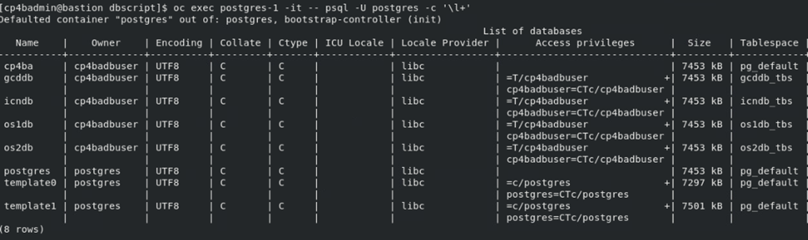
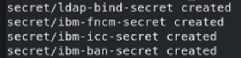
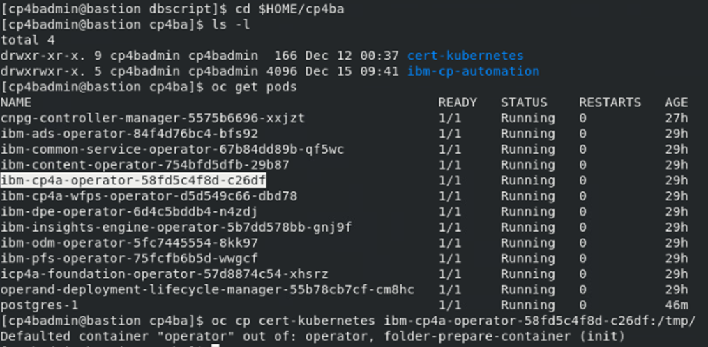
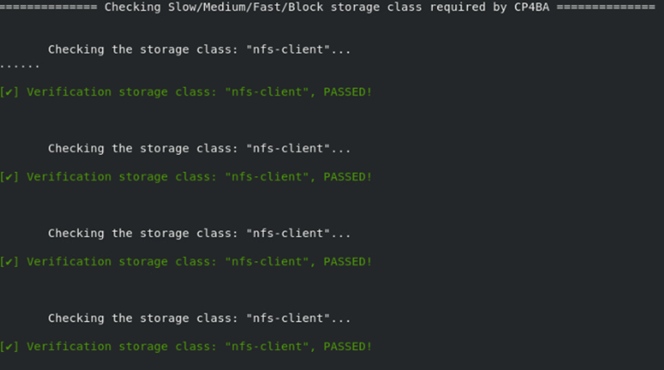
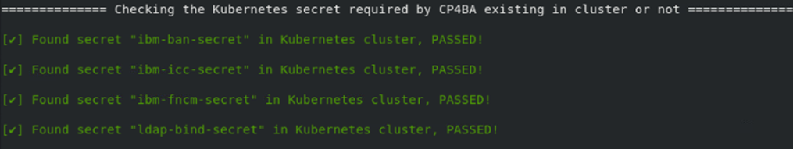
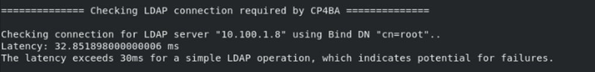

# Exercise 6: Generating CP4BA Databases and Verifying Configuration

# 6.1 Introduction

In the last two exercises, the configuration parameters in the property files created by the `cp4a-prerequisites.sh` script, have been set to the required values. This is a required precondition for 
running the `cp4a-prerequisites.sh` now in **generate** mode. In this mode, the script will first review completeness of the configuration variables, and will then generate the required Kubernetes secret definitions, as well as sql scripts to create the databases on the PostgreSQL database server.

The PostgreSQL database creation scripts need to be copied into the PostgreSQL database server. They need some manual modifications, as PostgreSQL deployments with different operators are different from each other. The DB scripts can be transferred, edited and executed one by one, or as its done here, concatenated to each other and executed as one large script. As the files are in different directories, the concatenation approach seems easier, and is applied here.

Attention must be applied with editing of the database creation scripts. If thats done incorrectly, all databases might at the end use a single tablespace, which will limit overall performance. Follow the Valiation steps in the last section to verify which tablespace is defined for which database.

Applying the Kubernetes secrets is easy, it can be done using the steps indicated here. Alternatively another script from the case package can also be used.

In the verification section of this Exercise, the `cp4a-prerequisites.sh` script run in **validate mode**, to validate the configuration and deployment of the prerequisites. As the connection to the database is also verified, and as the database can only be reached from inside the Kubernetes cluster, the checks cannot be run directly on the bastion node, without giving error messages from the unavailable database server. Therefore, to run the validation, the case package script is copied into the `/tmp` directory of the CP4BA Operator, and run from there. 

# 6.2 Exercise Instructions

1.	Switch to the **Terminal** window. Change to the **cert-kubernetes/scripts** directory.

    ```
    cd $HOME/cp4ba/cert-kubernetes/scripts
    ```

2.	Run the **cp4a-prerequisites.sh** script in **generate** mode. In this mode, information configured in the property files is reviewed, and the CP4BA Configuration files are generated. 

    ```
    ./cp4a-prerequisites.sh -m generate
    ```

	If error messages are printed, get back to the last exercise and edit the two property files, to find any configuration value which still contains a `<required>` value.
	
    > Note When running it without parameters, the `cp4a-prerequisites.sh` scriptsupplies a usage.
	
	> 
 
4.	The script does not ask for further input, in this mode. Result of checking the property files is indicated in green or red color, red color indicates errors or missing values. 

    Expected output:
	
	
 

7.	The database creation scripts are generated in directory **cp4ba-prerequisites/dbscript**, so change into that directory.

    ```
    cd cp4ba-prerequisites/dbscript
    ```
	
8.	Generate a combined database creation script, by collecting all files ending in .sql, and concatenating into one named dbscript.

    ```
    find . -name \*.sql | xargs cat > dbscript
    ```

9.	Edit the generated script, and comment the **create role** and the **create tablespace** commands, as the user and the tablespace have been pre-created through the CloudNativePG Operator. Each statement, **create role** and the **create tablespace** should appear 4 times, once for every database. 

    ```
    gedit dbscript
    ```
	
10.	Also, some connection reset statements need to be added, because the single DB creation scripts were concatenated. After each statement **grant create on tablespace**, the statement "\c" needs to be added, to reset the connection to the lastly created database. This is also needed 4 times.

11. Further, in the create database commands, the tablespace clause is missing, when using CP4BA 23.0.2 Base release. The problem is fixed in later IFIXes. They need to be inserted.

    Refer to [Complete Modified DB Creation Script](Images/7.1-complete-modified-db-creation-script-base-release.png) for verification of the completed modifications.

11.	For creating the databases, the db creation script needs to be made available in the Postgres Pod. The CloudNativePG Postgres operator automatically protects the container filesystem from modifications. The directory where the database configuration is stored, is an exception. Copy the db creation script into that directory, in the Postgres Pod.

    ```
    oc cp dbscript postgres-1:/var/lib/postgresql/data/dbscript
    ```
	
12.	Now run that script.

    ```
    oc exec postgres-1 -it -- psql -U postgres -f /var/lib/postgresql/data/dbscript
    ```

    Expected output:
	
	
  
13.	Check the created databases with the psql command \l+

    ```
    oc exec postgres-1 -it -- psql -U postgres -c '\l+'
    ```

    Expected output:

    
	
	Verify especially that the correct tablespaces (last column) are assigned to the databases. 
	
	If the script was not yet correct, and the tablespaces are showing up incorrectly, you can delete the Postgres cluster `oc delete -f postgres.yaml`, recreate it `oc apply -f postgres.yaml`.
	Before applying the dbscript again, copy the modified postgresql.conf file into the Postgres pod, and rerun Postgres by deleting the pod.
 
14.	The next steps is to apply the generated secrets. Thankfully the secrets are ready and don’t need manual updating.

    ```
    cd ../secret_template
    find . -name \*.yaml | xargs -l oc apply -f
    ```

    Expected output:
	
	
	
## 6.3 Validation steps
 
In this section, the `cp4a-prerequisite.sh` is executed in validate mode. This is an optional step, but highly recommended to verify consistency of the specification, and check for common problems.
 
1.	When the databases are created, the settings should be validated before providing the specifications to the CP4BA Operator. As the connection to the Postgres database can only be validated from within a pod, the complete specification script directory needs to be copied into the cp4ba operator.

    ```
    cd $HOME/cp4ba
    oc get pods
    oc cp cert-kubernetes <cp4ba operator podname>:/tmp/
    ```

    Expected output:
	
	
 
2.	Run a shell inside the Operator, and run the validation script. At the beginning of its execution, some error messages on unavailable command tput and clear are printed. Those are not harmful.

    ```
    oc exec <cp4ba operator podname> -it -- bash
    cd /tmp/cert-kubernetes/scripts
    ./cp4a-prerequisites.sh -m validate
    ```
    
Review the generated output. It checks not only the storage class, ldap settings and database settings, but measures also the typical connection delay to the LDAP server and the database. 

3. Expected output of storage class checking:
 
    

    With errors in this step, check if the right storage class names were provided, and whether the storage class is defined, by running `oc get storageclass`. With any updates, it needed to update the configuration, by re-running the prerequisite script in generate mode, see beginning of this chapter for reference.

4. Expected output of secret checking

    
 
    With errors in this step, please check if the files with the Kubernetes secrets were correctly applied, see last step of preceding section for reference.

5. Expected output of LDAP connection speed testing
 
    
	
	With errors in this step, check if the SDS is running, and whether the correct IP address and port number were configured in the properties files. If SDS is not running, or not responding correctly, it can be restarted by running `sudo systemctl restart sds`. If configuration files need to be updated, generate the configuration again, apply the secrets, and rerun these verification steps. If *only* the latency is bad, this can be ignored in this sample environment. In a production environment of a customer, this would need to be investigated properly.
	
6. Expected output of Database configuration and connection speed checking
 
    
	
	With errors in this step, determine if the databases are incorrectly created (run the psql command \l+), or if database server address or database user / password are incorrect. If its needed to recreate the databases, it might be needed to delete the Postgres deployment ``oc delete -f Postgres.yaml``. Check if all resources from PostgreSQL databases are gone, only the operator should still exist. Then follow steps above to recreate the databases. 
	
7.  Exit out of the Operator

    ```
    exit
    ````
	
Congratulations, with completion of this exercise, the required prerequisites for the deployment of Cloud Pak For Business Automation should be in place. In the [next exercise](Exercise-7-Deploy-CP4BA.md), the case package script `cp4a-deployment.sh` is used to generate the so-called *CR* (shorthand for Custom Resource). Applying that YAML file to Kubernetes will kick-start the deployment of the Cloud Pak For Business Automation.
