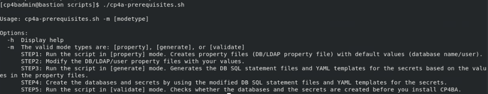
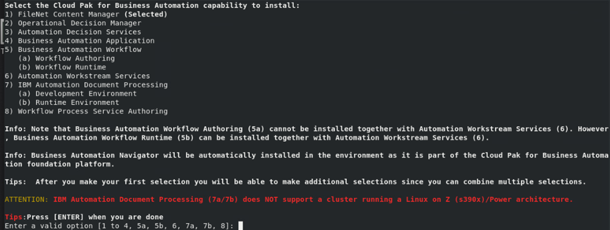
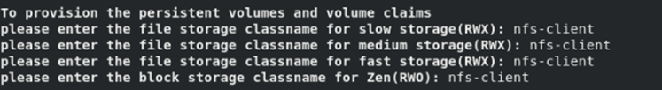
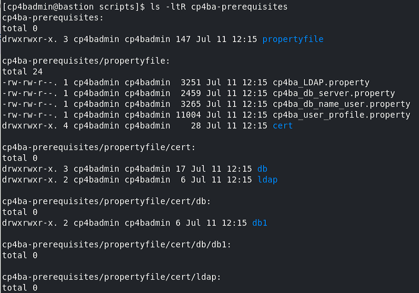

# Exercise 3: Preparing the Deployment

## 3.1 Introduction

Also in older versions of Coud Pak For Business Automation, the cert-kubernetes package contained a script, with which a deployment of Cloud Pak for Business Automation can be generated. This script is called `cp4a-deployment.sh`, and is still used to generate the so-called "*CR*" file, which is a YAML file for the ICP4ACluster custom resource definition and specifies, which components to install for a Cloud Pak For Business Automation Deployment.

In more recent versions, support for generating prerequisites, and verification of settings was added to the cert-kubernetes package, via a script called `cp4a-prerequisites.sh`. That script covers creation of required databases, Kubernetes secrets, and can also review the configuration for known problems. 

In order to create the correct databases, when running the `cp4a-prerequisites.sh` already, information about the deployment is required, i.e. what components need to be installed. That information can later be re-used when running the `cp4a-deployment.sh` script. The `cp4a-prerequisites.sh` script is used in different stages, those stages are provided to the script by the mode parameter value. The first mode, which will also be used here, is the **property** mode, in which the script will ask about details on the CP4BA deployment to be done, and generate property files. These property files then need to be filled out and through this, the names of databases, ldap groups, et cetera are specified.

Filling out the property values will be done in the next two exercises, step by step. When the property values are all filled out, the `cp4a-prerequisites.sh` can be invoked in **generate** mode. In this mode the provided information is taken to create the database creation scripts, as well as the Kuberetes secret definitions. With the generated files, the CP4BA databases need to be created. When this has been completed, with the last mode called **validate**, the integrity of the prerequisite configuration can be checked, so that the deployment can be completed.


## 3.2 Exercise Instructions

1.	Switch to the **Terminal** window. Change to the cert-kubernetes/scripts directory.

    ```sh
    cd $HOME/cp4ba/cert-kubernetes/scripts
	```

3.	Run the cp4a-prerequisites.sh script in prepare mode. In this mode, information about the deployment is gathered, and property files are generated to supply required parameters.

    ```sh
    ./cp4a-prerequisites.sh -m property
    ```

    > When running it without parameters, it supplies a usage.
	
    > 
 
5.	First step is to collect, which components should be deployed. Select there only the FileNet Content Manager, by selecting **1**. Then simply press Return to continue.

    

	> Note that the selection of the components does not need to be repeated, when running the `cp4a-deployment.sh` script later, as the selected settings are stored and the information is reused.
 
6.	The IBM Content Navigator / Business Automation Navigator and GraphQL will automatically be deployed too. Select the "Content Search Services" and "Content Manager Interoperability Services" as well, by selecting **1** followed by **2**, then press Return to continue.

    
 
7.	As the next step, the script asks for the kind of LDAP server, which will be used. Select the "IBM Tivoli Directory Server / Security Directory Server".

8.	As the next step, the script asks for the name of the storage class for slow, medium and fast storage volumes, and for block storage volumes. In the last exercise it was shown how to obtain the value. The cluster has only one storage class named **nfs-client**. Provide that storage class on all four questions.

    
 
     The names of the storage classes are not checked at this point. Checking is done towards the end when invoking the `cp4a-prerequisites.sh` in validate mode. This allows to create the storage classes as part of the prerequisite installation.

9.	Next question is on the deployment size. The CP4BA deployment supports different deployment sizes, `small`, `medium` and `large`. Selecting a size will influence default sizes for most of the components of the Cloud Pak 4 Business Automation environment, influencing the number of pod replicas, as well as assigned memory and cpu for the pods. Those are only default values, though, which can be overridden, if needed, through definitions in the custom resource. Select to perform a "small" deployment.

10.	Next question is to select the kind of database to be used for the deployment. Since Version CP4BA Version 24.0.0, the Postgres EDB Operator, which is included in the Cloud Pak For Business Automation, and used for the deployment for example of the Zen Component, can also be used for automatic creation of the database pod, and the databases, similar as it is done for the **Starter** mode. In this Bring Up Lab however, we will manually setup the database and create and run the database creation scripts, so select **4** for "PostgreSQL".

11.	The deployment scripts supports usage of multiple different database servers on a deployment. To differentiate between them, alias names need to be provided. This deployment will use only 1, so select **db1** as the alias name(s).
 
    
	
12.	Supply the name of the Openshift Project / Namespace to deploy into, the value is **ibm-cp4ba**

13.	Outbound communication of the CP4BA components is needed, to access custom databases and other resources. It can even be important for the display of documents, if the environments hosts HTML Pages, which reference graphics from external resources, for example. As uncontrolled access to the internet can expose the environment to risks, it is a good idea to restrict outbound communication. This will have the CP4BA Operators create Openshift Network Policies to restrict the traffic. The general recommendation for the setting would be to restrict outbound communication, and then define some custom network policies to allow access to the needed resources. For this sample environment, we will not restrict outbound communication though, so select "No". 

    
 
14. Also since Version 24.0.0, the IM Metastore Db, Zen Metastore Db and BTS metastore DB can be stored on an external PostgreSQL Databases. Select "No" on the three questions to have them installed using databases created automatically through the PostgreSQL EDB Operator, as with earlier releases of CP4BA.

15. Also since Version 24.0.0, external certificates can be used for the Opensearch and the Kafka deployments. Select **No** on this question to have the CP4BA operator provisioning them.

16.	On the question how many object stores to deploy, select 2.

This concludes the information gathering, and a result page is printed in the Terminal window. 

# 3.3 Verification

The script should have created a directory with property files, for further configuration. 

List the files in the generated directory:

```sh
ls -ltR cp4ba-prerequisites
```
	

 

These configuration files need to be filled with values. Before we get to it, we will first deploy the database in the [next exercise](Exercise-4-Deploy-PostgreSQL.md).


