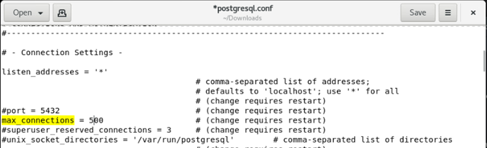
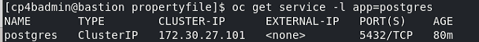
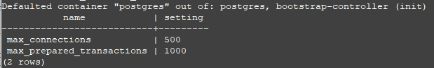

# Exercise 4: Deploy PostgreSQL

# 4.1 Introduction

In this section, the PostgreSQL database will be deployed, and the database related property files of the CP4BA deployment updated with required configuration values. 
For the deployment of the PostgreSQL database, the open source PostgreSQL container image from the docker repository will be used. For commercial usage, for example for Production environments of customers
with needed software support, there exist commercial products such as the EDB PostgreSQL provided with the CP4BA since version 24.0.0

# 4.2 Exercise Instructions

1.	Switch to the **Terminal** window. Change to the cp4ba directory.

    ```
    cd $HOME/cp4ba
    ```

2.  Create a subdirectory to maintain postgres, and change into this subdirectory
    ```sh
    mkdir postgres
    ```
    ```sh
    cd postgres
    ```

3.  Generate a self-signed certificate to be used with the PostgreSQL deployment. 
    ```sh
    openssl req -new -text -passout pass:passw0rd -subj /CN=localhost -out server.req
    ```
    ```sh
    openssl rsa -in privkey.pem -passin pass:passw0rd -out server.key
    ```
    ```sh
    openssl req -x509 -in server.req -text -key server.key -out server.crt
    ```
    
4.  Generate a Kubernetes TLS secret for the certificates.
    ```sh
    kubectl create secret tls postgres-tls --key server.key --cert server.crt
    ```

5.	Open a new tab in Firefox and navigate to the [LabData/postgres.yaml](LabData/postgres.yaml) file. Download the file **postgres.yaml** to the lab environment. To do that, with the content of the postgres.yaml file displayed in the Github window, right-click on the "Raw" link above and save the link to file.

    

5.	Change to the Terminal window. Copy the postgres deployment file to the current folder, and edit the **postgres.yaml** file to review its contents.

    ```
    cp ~/Downloads/postgres.yaml postgres.yaml
    gedit postgres.yaml
    ```

6.  No changes are needed in the **postgres.yaml** file. Review, that the postgres adminitrator will receive the name **pgadmin** and password **passw0rd** where the third-last character is a zero. A persistent volume claim having 20 Gbyte will be allocated for the database from the **nfs-client** storage class. The postgres pod will define a label named **app** with the value **postgres**, which can be used to search for the pod. Then close the editor again, and apply the specification:

    ```sh
    oc apply -f postgres.yaml
    ```
    Expect following output:
    ```sh
    serviceaccount/postgres created
    secret/postgres-secret created
    persistentvolumeclaim/postgres created
    deployment.apps/postgres created
    service/postgres created
    ```
	
7.	Deployment of PostgreSQL will first create an initialization pod, which sets up the persistent volume claim, then one new Postgres pod will be created. Monitor the output of the `oc get pods` command until the **postgres** pod is running. The form below will only list the Postgres pod, and wait for updates of the status. Abort when you see its running.

    ```
    oc get pods -l app=postgres -w
    ```

8.  To allow running commands in the Postgres Pod without looking up its name every time, it is recommended to set a shell variable.
    ```
    POSTGRES=$(oc get pods -l app=postgres -o 'jsonpath={.items[0].metadata.name}'); echo "Postgres Pod is $POSTGRES"
    ```

9.	The postgres Pod contains a single filesystem, which will be used for all of the tablespacs needed for the databases, and which still need to be created. Lets verify that postgres is now available and has no tablespaces defined yet. The required command is:
    ```
    oc exec $POSTGRES -- psql -U pgadmin -c '\db+'
    ```
    Following output is expected:
    ```
                                        List of tablespaces
        Name    |  Owner  | Location | Access privileges | Options |  Size  | Description 
    ------------+---------+----------+-------------------+---------+--------+-------------
     pg_default | pgadmin |          |                   |         | 29 MB  | 
     pg_global  | pgadmin |          |                   |         | 531 kB | 
    (2 rows)
    ```
	
10.	Some of the postgres parameters need further customization, so copy out the parameters file for modification. The first command shows the full pathname of the postgresql.conf configuration file, which is needed for the second commands.

    ```sh
    oc exec $POSTGRES -- find /var/lib -name postgresql.conf
    ```
    ```sh
    oc cp $POSTGRES:/var/lib/postgresql/data/pgdata/postgresql.conf postgresql.conf
    ```

11.	Now edit the postgresql.conf configuration file.

    ```
    gedit postgresql.conf
    ```

12.	The first place to change is the line showing **max_connections**. Change the value to at least **500**, which gives more than 50 connections per JDBC connector, as long as only one CPE pod is used.

    
 
13.	The second place to change is the line showing **max_prepared_transactions**. Remove the # character in front of the the line, and change the value to support **1000** prepared transactions. Read more about both updates in the CP4BA Documentation: https://www.ibm.com/docs/en/cloud-paks/cp-biz-automation/23.0.2?topic=tpdcpe-using-postgresql-max-connections-max-prepared-transactions

    

14. The third place to change is to insert some ssl-directives after the block with the ssl settings. The settings make the ssl certificate known to Postgres. Insert the following line after the block with the ssl settings, as shown in the picture:

    

    Insert the following lines:
    ```
    ssl = on
    ssl_cert_file = '/var/lib/postgresql/data/server.crt'
    ssl_key_file = '/var/lib/postgresql/data/server.key'
    ```

15.	Save the file and close the editor.

16.	Copy back the configuration file into the container. The directory containing it is backed up by a persistent volume, so any changes on it will persist. After copying the container, its required to restart Postgres, so delete the Pod for it to happen.

    ```
    oc cp postgresql.conf $POSTGRES:/var/lib/postgresql/data/pgdata/postgresql.conf
    ```
    ```
    oc delete pod $POSTGRES
    ```
    Monitor the Postgres pod for being started again:
    ```
    oc get pods -l app=postgres -w
    ```

    As after that the newly started Postgres Pod gets a new name, re-create the shell variable:
    ```
    POSTGRES=$(oc get pods -l app=postgres -o 'jsonpath={.items[0].metadata.name}'); echo "Postgres Pod is $POSTGRES"
    ```
    In the verification section below, we will verify that the changes to the configuration were successful.

	Next we need to confirm on the server name and port for connections to the database. 

	> **Note**: PostgreSQL performs normal and ssl-enabled communication over the same port, connections are upgraded to SSL after having been created.

17. As PostgreSQL is running in a pod, it can be reached through the service defined for it in the postgres specification. It can be seen that the default port for PostgreSQL is 5432. For the query we can also use the label which is used for the deployment, as shown below.

    

    The commands to determine this information are:

    ```
    oc get service -l app=postgres
    ```
     
18.	That service is made available through the DNS of Kubernetes, with the name <servicename>.<namespace/project>.svc. Pods within the same project/namespace can also use only the servicename. Lets check it by opening a shell in the operator pod, and test connectivity. 

     

    Of course the **curl** command cannot terminate, as PostgreSQL is not telnet, so abort it by pressing **Ctrl-C**. But the verbose output allows checking, if the connection can be made. Within Containers, connectivity cannot be checked with the usual ping command. The required commands are:

    ```
    oc get pod -l name=ibm-cp4a-operator
    oc exec <name of ibm-cp4a-operator pod> -it -- bash
    curl -v telnet://postgres.ibm-cp4ba.svc:5432
    ```
	
	You can close the shell in the Operator pod again.
	
19.	The next step is to update the property files, which have been generated previously, with the information from the Postgres database deployment. Navigate back to the directory containing them, and edit the files.

    ```
    cd $HOME/cp4ba/cert-kubernetes/scripts/cp4ba-prerequisites/propertyfile
    gedit cp4ba_db_server.property
    ```
	
24.	It is suggested to make the window wide enough to not be disturbed by the comments. Modify the server name, port, ssl, and client ssl settings in this file as indicated below.

    
 
    > Hint: The name of the server had been used in one of the previous steps. You can copy it from there.
	
26. For the PostgreSQL communication, we have enabled SSL, but disabled SSL_CLIENT_SERVER parameters. The comments in the parameters file describe, which further information is needed. Read that section carefully. Then save the file, and close the editor. 

27. The required certificate can be copied out of the directory where it was created, out of the Postgres pod, or out of the secret. The below command copies it out of the secret.

    ```
	oc get secret postgres-tls -o 'jsonpath={.data.tls\.crt}' | base64 --decode > cert/db/db1/db-cert.crt
	```
	
25.	Then invoke the editor again on the other database related property file. Before invoking the editor, just determine how the database password passw0rd looks like, when its base64 encoded, that string is required when editing the next file.

    ```
    echo -n passw0rd | base64
    gedit cp4ba_db_name_user.property
    ```
	
	**Note:** The **-n** option to echo will suppress the linefeed character, which echo normally prints following the output. If it is included, the linefeed will be part of the base64 encoded string, and might lead to illegal passwords, which are very hard to find later.
	
26.	First step for editing the document is to replace all passwords. You can invoke the search and replace function through the hamburger menu on top right corner (next to the Save button). You can copy and paste both values from the editor, and from the Terminal window. The password needs to be replaced 4 times, for the four databases.

    
 
27.	The next step is to replace the database user name. We will use one user account for all databases, so replace **<youruser1>** with **cp4badbuser** as indicated in the screenshot, 4 times. 
 
    
 
28.	Review the file, and check, if any further field need to be updated in the file, that should not be the case. So save the file, and quit the editor. 

## 4.3 Validation steps

Successful installation of the DB Server was verified by the steps above already. Successful modification of the database server and users property files will be done through running of the `cp4ba-prerequisite.sh` script in Validate mode, in a later exercise. 

A common error not detected (yet) by the prerequisite scripts in validate mode is to forget tuning the database configuration with increasing max connections and allowing prepared transactions. Therefore its recommended to double-check it at this point. Run the following command:

```
oc exec $POSTGRES -it -- psql -U pgadmin -c "select name,setting from pg_settings where name IN ('max_connections', 'max_prepared_transactions') ;"
```

It should print following table:



Further lets check, if the SSL settings were accepted:
```
oc exec $POSTGRES -it -- psql -U pgadmin -c "select name,setting from pg_settings where name LIKE 'ssl%' ;"
```
Which should lead to:


In the [Next Exercise](Exercise-5-Configure-LDAP.md) the remaining configuration values,  as well as the LDAP-server related configuration values will be updated in the property files.
