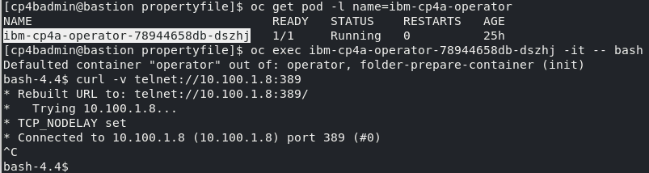

# Exercise 5: Apply LDAP Configuration

# 5.1 Introduction

In prior exercises, empty property files were created by running the `cp4a-prerequisites.sh` in generate mode. Some of the property files were also modified with concrete values, in the last exercise, after having created the PostgreSQL database server. 

In this exercise, the remaining configuration settings will be made. The exercise will also validate that the LDAP Server is running, and can be connected from the CP4BA Operators, by running it to export an LDIF file, with defined users and groups. 

# 5.2 Exercise Instructions

1.	Switch to the **Terminal** window. Change to the **propertyfile** directory inside the **cert-kubernetes/scripts** directory.

    ```
    cd $HOME/cp4ba/cert-kubernetes/scripts/cp4ba-prerequisites/propertyfile
    ```
	
2.	Check if the Security Directory Server is running. 

    ```
    systemctl status sds
    ```

    Expected output:

    
 
3.	Determine the IP address of the bastion host. That value will later be the LDAP Server hostname.

    ```
    ip a
    ```

    Expected output, the IP address is marked in red:
	
	
 
4.	To check connectivity from the OCP cluster, we will again use the curl command from the ibm-cp4a-operator. Determine first the complete name of the pod, and insert that value in the next command to open a shell. Then verify connectivity with the curl command. You need to abort it again, when seeing that the connection could be established.

    ```
    oc get pod -l name=ibm-cp4a-operator
    oc exec <name of ibm-cp4a-operator pod> -it -- bash
    curl -v telnet://10.100.1.8:389
    ```

    Expected output:
	
	
 
5.	Still in the shell in the ibm-cp4a-operator, we can verify the ldap credentials as well as getting the usernames

    ```
    ldapsearch -x -b 'dc=example,dc=com' -H ldap://10.100.1.8:389 -D cn=root -W
    ```
	
	**Note:** Care must be taken when using this command on a production installation, where the connected LDAP Server might be used by all users of a company: The output would be very long, the runtime high. 
	In this kind of environments, query a useful subset of the LDAP Server only.

    The command will prompt for the admin password for the LDAP server. Provide the value **passw0rd123** with a zero. The output should list the DN values of all users and groups, among them the admin user named **cp4badmin** and the group **cp4badmins**. Exit the shell, by pressing Ctrl-D.
	
6.	The passwords in the property files can be supplied unencrypted or as a base64 encrypted string, to allow for inclusion of any special characters. Therefore, before invoking the editor, just determine 
    how the LDAP bind user password `passw0rd123` looks like, when its base64 encoded. Alternatively you could specify the password without base64 encryption, in which case it would be needed to 
    remove the `{Base64}` prefix preceeding the value. 

    ```
    echo -n passw0rd123 | base64
    ```

	**Note:** The **-n** option to echo will suppress the linefeed character, which echo normally prints following the output. If it is included, the linefeed will be part of the base64 encoded string, and might lead to illegal passwords, which are very hard to find later.
	
7.	Now edit the LDAP Server property file.

    ```
    gedit cp4ba_LDAP.property
    ```
	
8.	Most of the needed configuration values are contained already in the ldapsearch query executed above. The single exception to this is the SSL support, which would be disabled for now. For completeness, below table contains the values which need to be replaced. Make sure to retain the quotation marks. 

    | Config Option          | Value                     |
    | ---------------------- | ------------------------- |
    | LDAP_SERVER	         | 10.100.1.8                |
    | LDAP_PORT	             | 389                       |
    | LDAP_BASE_DN	         | dc=example,dc=com         |
    | LDAP_BIND_DN	         | cn=root                   |
    | LDAP_BIND_DN_PASSWORD	 | {Base64}cGFzc3cwcmQxMjM=  |
    | LDAP_SSL_ENABLED	     | False                     |
    | LDAP_GROUP_BASE_DN	 | dc=example,dc=com         |

    > With the rest of the configuration values, it can be changed which LDAP property is used to identify a user or group, and how to determine a groups members. They need only to be changed to perform advanced configuration changes.
	
9.	Before editing the last configuration file, we again need the base64 encrypted value for the **cp4badmin** user, which we will also use as LTPA password and keystore password. The 0 is a zero.

    ```
    echo -n passw0rd | base64
    ```
	
	**Note:** The **-n** option to echo will suppress the linefeed character, which echo normally prints following the output. If it is included, the linefeed will be part of the base64 encoded string, and might lead to illegal passwords, which are very hard to find later.
	
	
10.	Now edit the CP4BA user name configuration file.

    ```
    gedit cp4ba_user_profile.property
    ```

11.	When editing the file, all passwords are set to the base64 encrypted value resulting from above command. All admin user names are set to cp4badmin, and all admin groups to cp4badmins. The Object Store users group is set to cp4bausers. There are only few other values to replace. Some values are already preconfigured from the answers provided when generating the property files.

    | Complete Configuration Reference                     	                  |
	| ----------------------------------------------------------------------- |
    | CP4BA.CP4BA_LICENSE="non-production"                                    |
    | CP4BA.FNCM_LICENSE="non-production"                                     |
    | CP4BA.SLOW_FILE_STORAGE_CLASSNAME="nfs-client"                          |
    | CP4BA.MEDIUM_FILE_STORAGE_CLASSNAME="nfs-client"                        |
    | CP4BA.FAST_FILE_STORAGE_CLASSNAME="nfs-client"                          |
    | CP4BA.BLOCK_STORAGE_CLASS_NAME="nfs-client"                             |
    | CP4BA.ENABLE_FIPS="false"                                               |
    | CP4BA.ENABLE_RESTRICTED_INTERNET_ACCESS="false"                         |
    | CONTENT.APPLOGIN_USER="cp4badmin"                                       |
    | CONTENT.APPLOGIN_PASSWORD="{Base64}cGFzc3cwcmQ="                        |
    | CONTENT.LTPA_PASSWORD="{Base64}cGFzc3cwcmQ="                            |
    | CONTENT.KEYSTORE_PASSWORD="{Base64}cGFzc3cwcmQ="                        |
    | CONTENT.ARCHIVE_USER_ID="cp4badmin"                                     |
    | CONTENT.ARCHIVE_USER_PASSWORD="{Base64}cGFzc3cwcmQ="                    |
    | CONTENT_INITIALIZATION.ENABLE="Yes"                                     |
    | CONTENT_INITIALIZATION.LDAP_ADMIN_USER_NAME="cp4badmin"                 |
    | CONTENT_INITIALIZATION.LDAP_ADMINS_GROUPS_NAME="cp4badmins"             |
    | CONTENT_INITIALIZATION.CPE_OBJ_STORE_ADMIN_USER_GROUPS="cp4bausers"     |
    | BAN.APPLOGIN_USER="cp4badmin"                                           |
    | BAN.APPLOGIN_PASSWORD="{Base64}cGFzc3cwcmQ="                            |
    | BAN.LTPA_PASSWORD="{Base64}cGFzc3cwcmQ="                                |
    | BAN.KEYSTORE_PASSWORD="{Base64}cGFzc3cwcmQ="                            |
    | BAN.JMAIL_USER_NAME="<Optional>"                                        |
    | BAN.JMAIL_USER_PASSWORD="<Optional>"                                    |

12. The lower part of the configuration file contains settings for the SCIM directory provider, and the SCIM to LDAP mapping. No changes are needed in that session. 

    > **Note:** Review the settings for the SCIM directory provider. Notice that the values for the `SCIM.USER_UNIQUE_ID_ATTRIBUTE` and `SCIM.GROUP_UNIQUE_ID_ATTRIBUTE` are set to the 
    `dn` ldap attribute, which is the complete domain name. The consequence is for example, that when an LDAP group is renamed or moved to a different organizational unit, its unique id changes, and
    it can then not be found anymore under its original unique id value. This can affect the security configuration of a FileNet environment.

12.	Save the configuration file and close the editor.

# 5.3 Validation Instructions

The settings are validated by running the prerequisites script in generate and validate mode, in later exercises. So, for now please continue to generate and use the Database creation scripts in the [Next Exercise](Exercise-6-Generating-DBs.md).