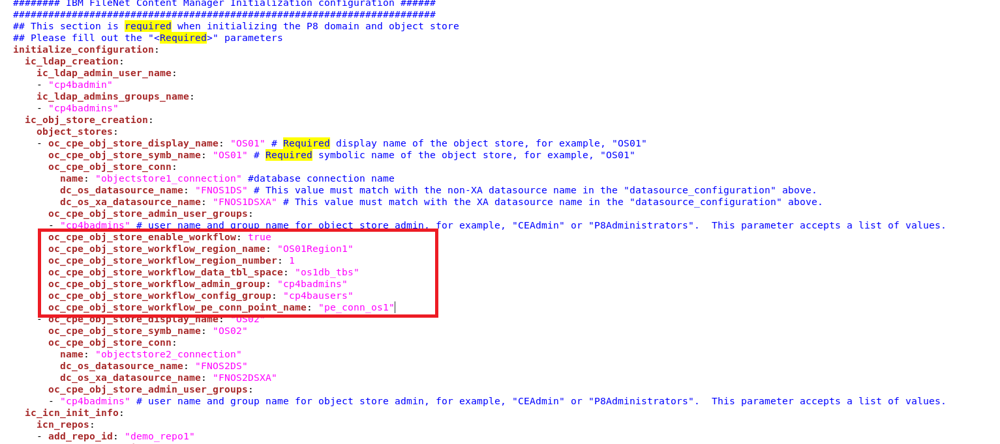
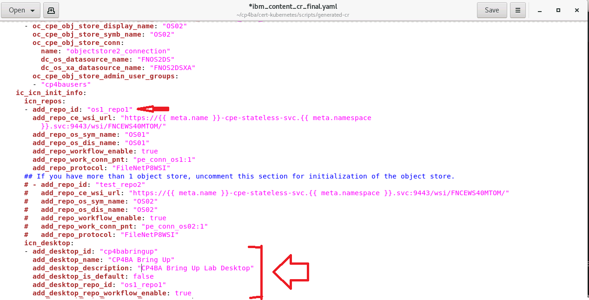

# Exercise 7: Deploy CP4BA

# 7.1 Introduction

All of the prerequisites required for the deployment of Cloud Pak For Business Automation have been installed in the previous execises, and the configuration has been validated by running the `cp4a-prerequisites.sh` in validate mode. 

With successful execution of the validation, the Case Package script `cp4a-deployment.sh` is invoked. As outlined earlier, the script detects and reuses the information made for the `cp4a-prerequisites.sh` script, so no real further informtion needs to be provided. The Case package script `cp4a-deployment.sh` generates the Custom Resource definition, which in our case is a Custom Resource of type *Content*. Applying it completes the deployment phase, and participants are due for a break to await further deployment done by the Cloud Pak For Business Automation Operators.

> **Note:** When deploying only the Content-Pattern, the Case package deployment scripts now generate a Custom Resource of type **Content**, where a general deployment of Cloud Pak for Business Automation would use the type **ICP4ACluster**. Gladly, the specifications are needing same settings, with the same syntax, and there would be few, if any settings allowed in one of them, but not on the other. So, if a configuration of type **Content** needs to be extended by components not covered by the Content Operator, such as Business Automation Insights or Business Automation Workflow, it would be needed to change the type of the CR file accordingly, and applying it to Kubernetes, for the operator to update the environment. Take care to not change the name of the CR file, only the type. 

# 7.2 Exercise Instructions

1.	Switch to the **Terminal** window. Change to the **cert-kubernetes/scripts** directory.

    ```
    cd $HOME/cp4ba/cert-kubernetes/scripts
    ```
	
2.	Run the deployment script.

    ```
    ./cp4a-deployment.sh
    ```
	
3.	Indicate that you accept the license.

4.	Next question is, if in the current OCP cluster you already have a deployment of FileNet Content Manager using the deployment scripts of FileNet. The answer is "No".

    
	
5.	Next question is about the kind of deployment  to do. Answer is Production deployment, so select 2.

6.	The script then checks to detect any previously made selection from the prerequisites script. Press Return to continue:

    
 
7.	The deployment goes into an OCP environment on private cloud, so select 2.
 
8.	The next output indicates, that the CP4BA deployment will use an internal administration account named "cpadmin". Luckily this is different from the one in our LDAP, which is cp4badmin, and also not any of the users in the LDAP. So answer "Yes" to the question whether to use this name.

 
9.	In the next question, the script offers to use customized JDBC drivers. If that would be needed, the drivers need to be made available on a URL. In case of an Air-Gapped environment, this would mean that a webserver needs to be configured as a separate pod. As we can use the provided drivers, we can bypass the question by pressing Return.

    > Note: In case ICCSAP is needed in the configuration, SAP libraries for connecting to SAP need to be provided through this mechanism as well.

    > Note: The provided drivers are also available in the subdirectory "jdbc" of the scripts directory after deployment of the cp4ba operator.
	
10.	Next, the script provides a summary of the configuration settings for review. Answer "Yes" to indicate the information is correct.

11.	The script generates the specification file for Cloud Pak 4 Business Automation in the directory `generated-cr`. 

12. Then the scripts asks, in which project the CP4BA operands (running pods and configuration information) should be generated. Provide the namespace `ibm-cp4ba` on this question. After completing this step, navigate into the `generated-cr` directory, and review the generated Custom Resource file.

    ```
    cd generated-cr
    ls -l 
    ```

13. Review, if any required fields are left to be filled out in the custom resource. The first command prints a version of the custom resource, which does not have any comments anymore. The grep command then searches for the required keyword, and lists two lines before and after it for a context.

    ```
    sed 's/#.*$//g' ibm_content_cr_final.yaml | grep -A2 -E2 -i '<required>'
    ```
    
14. Run an editor with the custom resource. Locate any sections above and provide a value. The required value for the `oc_cpe_obj_store_admin_user_groups` field is `cp4badmins`, it case it occurs.

    Note that the deployment scripts have chosen a specification for the "Content" Custom Resource Definition, which is being worked by the Content Operator. So any error messages will be logged by the Content Operator. Other deployments of the Cloud Pak for Business Automation, which also include other patterns, such as Business Automation Workflow would require a different kind of specification, using the "ICP4ACluster" Custom Resource Definition, which would be worked by the CP4A Operator.

    Also, the "CR", the "Custom Resource" as it is called, is not always named "icp4acluster". This one has the default name "content", which you are free to change if needed. That name will be used in many derived names though, including some of the secret names, so better don’t change it for the moment.
	
    For editing Custom Resources, or more general YAML files, it is good to use an editor supporting the special requirements of YAML files, and also supporting syntax highlighting. The author of this lab uses emacs for this purpose, and the yaml-mode for Emacs, which is available through open-source. Of course there are further options.
    
    ```
    gedit ibm_content_cr_final.yaml
    ```
 
14. In the Custom Resource which is open in the Editor, search for `initialize_configuration`. In some versions, the required values for the `oc_cpe_obj_store_admin_user_groups` settings are not properly copied from the propertyfiles to the CR. Update the values, the group name is `cp4badmins`.

15. Note that no FileNet Process Engine Workflow system has been requested on any of the two object stores OS01 and OS02. Also note (by reviewing the `ic_icn_init_info` section) that Content Navigator will contain only the repository connection for the first object store, and give it the name `demo_repo1`. Update the settings as shown here:

    

    Insert the following lines at the indicated position. Take care to indent correctly. In YAML files, tabs must not be used for indenting, and each indentation step must be two spaces. For the addition, every line must be indented with exactly 8 spaces, no tabs.

    ````
            oc_cpe_obj_store_enable_workflow: true
            oc_cpe_obj_store_workflow_region_name: "OS01Region1"
            oc_cpe_obj_store_workflow_region_number: 1
            oc_cpe_obj_store_workflow_data_tbl_space: "os1db_tbs"
            oc_cpe_obj_store_workflow_admin_group: "cp4badmins"
            oc_cpe_obj_store_workflow_config_group: "cp4bausers"
            oc_cpe_obj_store_workflow_pe_conn_point_name: "pe_conn_os1"
    ````

    > **Note:** The FileNet Process Engine workflow system, which is being created in OS01 from the above specification, is needed on the BAWTOS Object store(s), for the implementation of Case Manager solutions.

15. A few lines further down you find the `ic_icn_init_info` section, with information about the required initialization of IBM Content Navigator (ICN). Make the changes which are outlined below. Take care when editing the repo_id field, that it must be configured at two places, and both places need the same value. Save your changes and close the Editor.

    
    
14. Before you can apply the specification, it is needed to synchronize the clocks between the worker nodes of the Openshift cluster, find more on this topic in the documentation on
    https://www.ibm.com/docs/en/cloud-paks/cp-biz-automation/24.0.0?topic=cpd-option-1b-deploying-custom-resource-you-created-deployment-script. 

    ```
    oc get node -l node-role.kubernetes.io/worker --no-headers -o name | xargs -I {} --  oc debug {} -- chroot /host sh -c 'systemctl restart chronyd'
    ```

15.	Apply the specification. 

    ```
    oc apply -f ibm_content_cr_final.yaml
    ```
	
    **Note:** If you get errors, review if you have used inproper indentation on the above changes. If you have, correct the indentation and try again.

# 7.3 Verification Instructions	
	
At this point, the operator will start deployment according to the specification. During first half hour or so, nothing much will be notable from the working, as foundational components need to be deployed first. 

If you like looking at some changing text, you can open two Terminal windows and run these two commands in them, one in each. The first one displays the pods which are defined in the current project, the second one fetches the podname of the Content Operator, and displays its logging output,  thereby filtering out the lines containing the word "info".

    ```
    watch oc get pods
    oc logs $(oc get pod -l name=ibm-content-operator -o jsonpath={.items[0].metadata.name}) -f | grep -v info
    ```

Error messages in the logs would have red color, and typically contain keyword "failed", but not all error messages might require followup actions. For monitoring the deployment the best option might be to await the end of the current loop of the Content Operator, and start from reviewing its status, which can easily be viewed from the Openshift Console window. Refer to the [Next Exercise](Exercise-8-PostDeployment.md) for instructions on monitoring the deployment and on required post-deployment activity.
