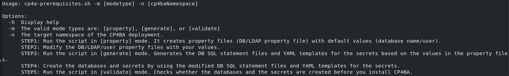
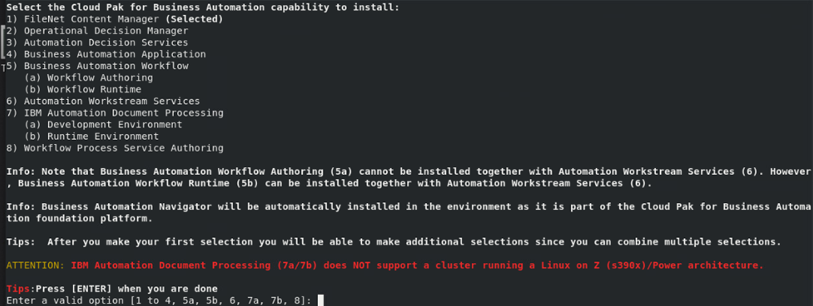
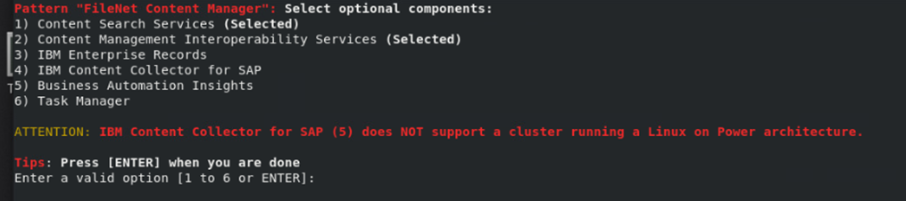
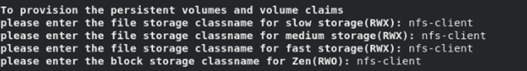
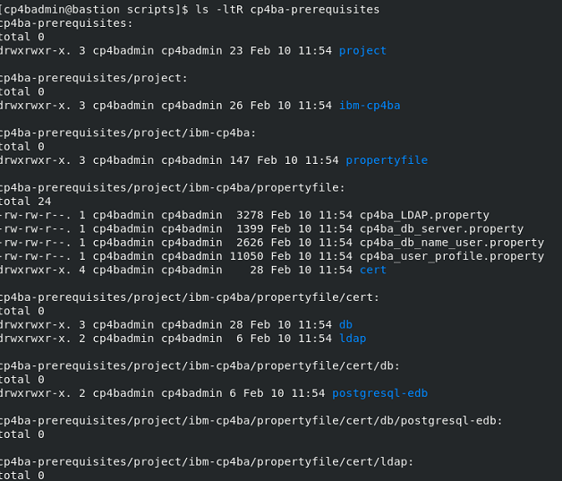
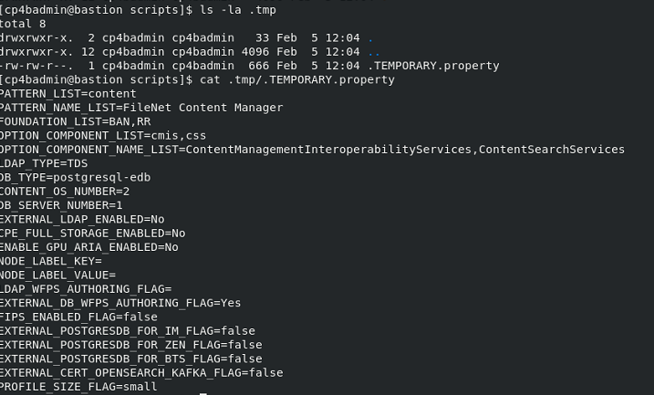

# Exercise 3: Preparing the Deployment

## 3.1 Introduction

The cert-kubernetes package containes a script, with which a deployment of Cloud Pak for Business Automation can be generated. This script is called `cp4a-deployment.sh`, and is still used to generate the so-called "*CR*" file, which is a YAML file for the ICP4ACluster custom resource definition and specifies, which components to install for a Cloud Pak For Business Automation Deployment.

In more recent versions though, support for generating prerequisites, and verification of settings was added to the cert-kubernetes package, via a script called `cp4a-prerequisites.sh`. That script covers creation of required databases, Kubernetes secrets, and can also review the configuration for known problems. 
In order to create the required databases, when running the `cp4a-prerequisites.sh` already, information about the deployment is required, i.e. what components need to be installed. That information can later be re-used when running the `cp4a-deployment.sh` script. 

The `cp4a-prerequisites.sh` script is used in different stages, those stages are provided to the script by the mode parameter value. The first mode, which will also be used here, is the **property** mode, in which the script will ask about details on the CP4BA deployment to be done, and generate property files. These property files then need to be filled out and through this, the names of databases, ldap groups, et cetera are specified.

Filling out the property values will be done in the next exercises. When the property values are all filled out, the `cp4a-prerequisites.sh` can be invoked in **generate** mode. In this mode the provided information is taken to create the database creation scripts, as well as the Kuberetes secret definitions. With the generated files, the CP4BA databases need to be created. When this has been completed, with the last mode called **validate**, the integrity of the prerequisite configuration can be checked, so that the deployment can be completed.

The `cp4a-prerequisites.sh` will, when we later execute it in verify mode, try to determine if the configurations are correct. Unless the embedded PostgresSQL is used, it will also need to connect to the databases for verification. If the databases are deployed inside the OCP environment, connection from outside is not possible. Therefore, the deployment scripts can also be run from inside the CP4A Operator. This way, you need a bastion host only for deployment of Air-Gap repositories, and the Operator installation. 

However, as this deployment will be using Embedded EDB Postgres, the `cp4a-prerequisites.sh` will not need to connect to the databases. Therefore, it can be run from outside the OCP environment.

## 3.2 Exercise Instructions

1.	Switch to the **Terminal** window. Change to the cert-kubernetes directory.

    ```sh
    cd $HOME/cp4ba/cert-kubernetes/scripts
	```

2.  Run the cp4a-prerequisites.sh script in prepare mode. In this mode, information about the deployment is gathered, and property files are generated to supply required parameters. The script also needs to be informed about the name of the namespace. It uses the name to create subdirectories to separate different deployments.

    ```sh
    ./cp4a-prerequisites.sh -m property -n ibm-cp4ba
    ```

    > When running it without parameters, it supplies a usage.
	
    > 
 
3.	First step is to collect, which components should be deployed. Select there only the FileNet Content Manager, by selecting **1**. 

    

    Then simply press Return to continue. 

	> Note that the selection of the components does not need to be repeated, when running the `cp4a-deployment.sh` script later, as the selected settings are stored and the information is reused.
 
4.	The next screen shows the optional components for the selected modules above. The IBM Content Navigator / Business Automation Navigator and GraphQL will automatically be deployed. Select the "Content Search Services" and "Content Manager Interoperability Services" as well, by selecting first  **1** followed by **2**. 

    

    Then press Return to continue.
 
5.	As the next step, the script asks for the kind of LDAP server, which will be used. Select the "IBM Tivoli Directory Server / Security Directory Server".

6.	As the next step, the script asks for the name of the storage class for slow, medium and fast storage volumes, and for block storage volumes. In the last exercise it was shown how to obtain the value. The cluster has only one storage class named **nfs-client**. Provide that storage class on all four questions.

    
 
     The names of the storage classes are not checked at this point. Checking is done towards the end when invoking the `cp4a-prerequisites.sh` in validate mode. This allows to create the storage classes as part of the prerequisite installation.

7.	Next question is on the deployment size. The CP4BA deployment supports different deployment sizes, `small`, `medium` and `large`. Selecting a size will influence default sizes for most of the components of the Cloud Pak 4 Business Automation environment, influencing the number of pod replicas, as well as assigned memory and cpu for the pods. Those are only default values, though, which can be overridden, if needed, through definitions in the custom resource. Select to perform a "small" deployment.

8.	Next question is to select the kind of database to be used for the deployment. Since Version CP4BA Version 24.0.0, the Postgres EDB Operator, which is included in the Cloud Pak For Business Automation, and used for the deployment for example of the Zen Component, can also be used for automatic creation of the database pod, and the databases, similar as it is done for the **Starter** mode. To choose the automatically deployed EDB Postgres, so select **8** for "EDB PostgreSQL".

9.  In the next question, creation of sample network policy files is offered. While the network policies were automatically created in earlier releases, this has been disabled since Version 25.0.0. The network policies can be manually created after the deployment is complete, though. Answer **Yes** to have them created.
      
10.	On the question how many object stores to deploy, select **2**.

This concludes the information gathering, and a result page is printed in the Terminal window. 

# 3.4 Verification

The script should have created a directory with property files, for further configuration. 

List the files in the generated directory:

```sh
ls -ltR cp4ba-prerequisites
```
	


The script has also generated a hidden file with the keyboard entries. It can be used to rerun the script with skipping the questions already answered.

```sh
ls -la .tmp
cat .tmp/.TEMPORARY.property
```



The screenshot is for the Embedded EDB Postgres. If you have chosen External PostgresSQL, the DB_TYPE option will appear as `postgresql`.
 
Continue with setting up the required settings for LDAP on [Exercise 4](Exercise-4-Configure-LDAP.md).


