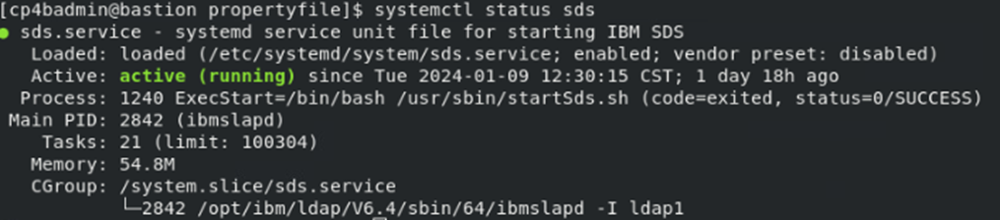
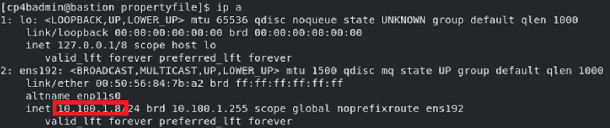
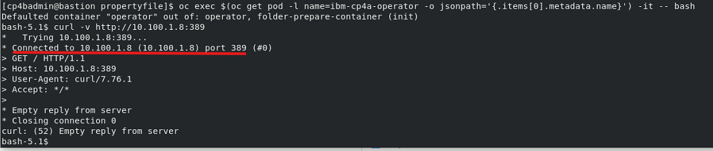

# Exercise 4: Apply LDAP Configuration

# 4.1 Introduction

In prior exercises, empty property files were created by running the `cp4a-prerequisites.sh` in generate mode. 

In this exercise, the configuration settings will be made. The exercise will also validate that the LDAP Server is running, and can be connected from the CP4BA Operators, by running it to export an LDIF file, with defined users and groups. 

# 4.2 Exercise Instructions

1.	Switch to the **Terminal** window. Change to the **propertyfile** directory inside the **cert-kubernetes/scripts** directory.

    ```
    cd $HOME/cp4ba/cert-kubernetes/scripts/cp4ba-prerequisites/project/ibm-cp4ba/propertyfile
    ```
	
2.	Check if the Security Directory Server is running. 

    ```
    systemctl status sds
    ```

    Expected output:

    
 
3.	Determine the IP address of the bastion host. That value will later be the LDAP Server hostname.

    ```
    ip a
    ```

    Expected output, the IP address is marked in red:
	
	
 
4.	To check connectivity from the OCP cluster, we will again use the curl command from the ibm-cp4a-operator. The first command determines the name of the ibm-cp4a-operator pod. That command is embedded at the right place in the second command, which runs bash inside a specific pod, and redirects input and output to the terminal.

    ```
    oc get pod -l name=ibm-cp4a-operator -o jsonpath='{.items[0].metadata.name}' && echo
    oc exec $(oc get pod -l name=ibm-cp4a-operator -o jsonpath='{.items[0].metadata.name}') -it -- bash
    ```
 
5.  Then verify connectivity with the curl command. Of course you get an error at the end, LDAP Servers are not using the HTTP protocol. The important part of the output is, that before the error message is printed, a connection has been established. If there would be a connectivity problem, this statement would not be printed. 
    ```
    curl -v http://10.100.1.8:389
    ```
    Expected output:
	
	

5.	Still in the shell in the ibm-cp4a-operator, we can verify the ldap credentials as well as confirming the admin username

    ```
    ldapsearch -x -b 'dc=example,dc=com' -H ldap://10.100.1.8:389 -D cn=root -W '(uid=cp4badmin)'
    ```
	
	**Note:** Care must be taken when using this command on a production installation, where the connected LDAP Server might be used by all users of a company. If the ldap search command would not be containing the last query part, then the output would list the complete LDAP server.

    The command will prompt for the admin password for the LDAP server. Provide the value **passw0rd123** with a zero. The output should list the LDIF of the user named **cp4badmin**. Similarly, the group **cp4bausers** can be queried using
    
    ```
    ldapsearch -x -b 'dc=example,dc=com' -H ldap://10.100.1.8:389 -D cn=root -W '(cn=cp4bausers)'
    ```

    Exit the shell, by pressing Ctrl-D.
	
6.	The passwords in the property files can be supplied unencrypted, or xor encrypted, to allow for inclusion of any 
    special characters. Our password does not use special characters, so we can use the unencrypted version. 

    To generate a xor encrypted version of the password, the WebSphere Liberty securityUtility can be used, refer to its [documentation in Knowledge Center](https://www.ibm.com/docs/en/was-liberty/base?topic=applications-securityutility-command). The utility is installed in the CP4BA Operator and can be invoked from there. 
    
    ```
    oc exec $(oc get pod -l name=ibm-cp4a-operator -o jsonpath='{.items[0].metadata.name}') -c operator -- /opt/ibm/securityUtility/bin/securityUtility encode passw0rd123
    ```    


7.	Now edit the LDAP Server property file.

    ```
    gedit cp4ba_LDAP.property
    ```
	
8.	Most of the needed configuration values are contained already in the ldapsearch query executed above. The single exception to this is the SSL support, which would be disabled for now. For completeness, below table contains the values which need to be replaced. Make sure to retain the quotation marks. 

    | Config Option          | Value                     |
    | ---------------------- | ------------------------- |
    | LDAP_SERVER	         | 10.100.1.8                |
    | LDAP_PORT	             | 389                       |
    | LDAP_BASE_DN	         | dc=example,dc=com         |
    | LDAP_BIND_DN	         | cn=root                   |
    | LDAP_BIND_DN_PASSWORD	 | {xor}Lz4sLChvLTtubWw=     |
    | LDAP_SSL_ENABLED	     | False                     |
    | LDAP_GROUP_BASE_DN	 | dc=example,dc=com         |

    > With the rest of the configuration values, it can be changed which LDAP property is used to identify a user or group, and how to determine a groups members. They need only to be changed to perform advanced configuration changes.
 
9.	Before editing the last configuration file, we again need the base64 encrypted password for the **cp4badmin** user. We will use the same password as the LTPA and keystore password, however that one is needed with xor encoding, instead of base64 encoded. The 0 is a zero.

    ```
    echo -n "Bas64 encoded password: " && echo -n passw0rd | base64
    echo -n "XOR encoded password:   " && oc exec $(oc get pod -l name=ibm-cp4a-operator -o jsonpath='{.items[0].metadata.name}') -c operator -- /opt/ibm/securityUtility/bin/securityUtility encode passw0rd
    ```
	
	**Note:** The **-n** option to echo will suppress the linefeed character, which echo normally prints following the output. If it is included, the linefeed will be part of the base64 encoded string, and might lead to illegal passwords, which are very hard to find later.

    **Note:** It turned out to be a bit unpractical to have passwords encrypted with two different methods in the same configuration file. With the next version this problem was addressed, using only Base64 encrypted passwords again.
		
10.	Now edit the CP4BA user name configuration file.

    ```
    gedit cp4ba_user_profile.property
    ```

11.	When editing the file, all passwords are set to the base64 encrypted value resulting from above command. All admin user names are set to cp4badmin, and all admin groups to cp4badmins. The Object Store users group is set to cp4bausers. There are only few other values to replace. Some values are already preconfigured from the answers provided when generating the property files.

    | Complete Configuration Reference                     	                  |
	| ----------------------------------------------------------------------- |
    | CP4BA.CP4BA_LICENSE="non-production"                                    |
    | CP4BA.FNCM_LICENSE="non-production"                                     |
    | CP4BA.SLOW_FILE_STORAGE_CLASSNAME="nfs-client"                          |
    | CP4BA.MEDIUM_FILE_STORAGE_CLASSNAME="nfs-client"                        |
    | CP4BA.FAST_FILE_STORAGE_CLASSNAME="nfs-client"                          |
    | CP4BA.BLOCK_STORAGE_CLASS_NAME="nfs-client"                             |
    | CP4BA.ENABLE_FIPS="false"                                               |
    | CP4BA.ENABLE_GENERATE_SAMPLE_NETWORK_POLICIES="true"                    |
    | CONTENT.APPLOGIN_USER="cp4badmin"                                       |
    | CONTENT.APPLOGIN_PASSWORD="{Base64}cGFzc3cwcmQ="                        |
    | CONTENT.LTPA_PASSWORD="{xor}Lz4sLChvLTs="                               |
    | CONTENT.KEYSTORE_PASSWORD="{xor}Lz4sLChvLTs="                           |
    | CONTENT.ARCHIVE_USER_ID="cp4badmin"                                     |
    | CONTENT.ARCHIVE_USER_PASSWORD="{Base64}cGFzc3cwcmQ="                    |
    | CONTENT_INITIALIZATION.ENABLE="Yes"                                     |
    | CONTENT_INITIALIZATION.LDAP_ADMIN_USER_NAME="cp4badmin"                 |
    | CONTENT_INITIALIZATION.LDAP_ADMINS_GROUPS_NAME="cp4badmins"             |
    | CONTENT_INITIALIZATION.CPE_OBJ_STORE_ADMIN_USER_GROUPS="cp4badmins"     |
    | BAN.APPLOGIN_USER="cp4badmin"                                           |
    | BAN.APPLOGIN_PASSWORD="{Base64}cGFzc3cwcmQ="                            |
    | BAN.LTPA_PASSWORD="{xor}Lz4sLChvLTs="                                   |
    | BAN.KEYSTORE_PASSWORD="{xor}Lz4sLChvLTs="                               |
    | BAN.JMAIL_USER_NAME="<Optional>"                                        |
    | BAN.JMAIL_USER_PASSWORD="<Optional>"                                    |

12. The lower part of the configuration file contains settings for the SCIM directory provider, and the SCIM to LDAP mapping. No changes are needed in that session. 

    > **Note:** Review the settings for the SCIM directory provider. Notice that the values for the `SCIM.USER_UNIQUE_ID_ATTRIBUTE` and `SCIM.GROUP_UNIQUE_ID_ATTRIBUTE` are set to the 
    `ibm-entryuuid` ldap attribute. In previous deployments it had been set to `dn` with the consequence, that when an LDAP group is renamed or moved to a different organizational unit, its unique id changes, and it could then not be found anymore under its original unique id value. This problem should not occur anymore with the new setting.

12.	Save the configuration file and close the editor.

# 4.3 Validation Instructions

The settings are validated by running the prerequisites script in generate and validate mode, in later exercises. So, for now please continue to generate the prerequisites in the [Next Exercise](Exercise-5-Generating-Prereqs.md). If a different database than the EDB Postgres would be used, then the ``cp4a-prerequisites.sh` script would also generate the database setup scripts.