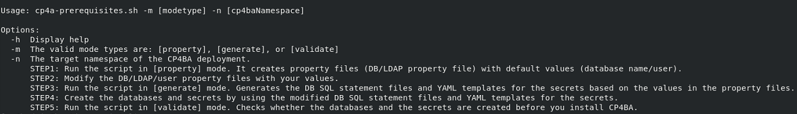
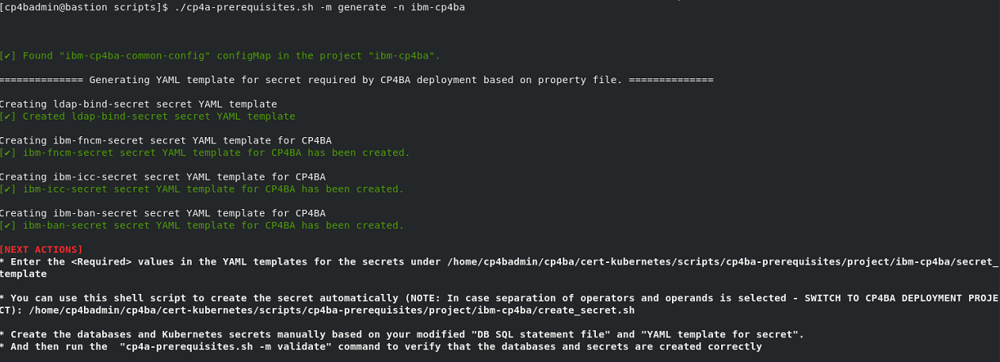
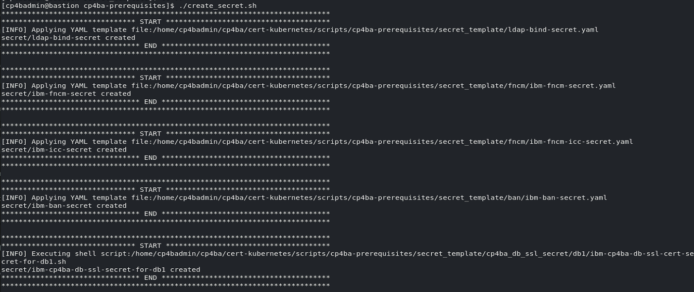
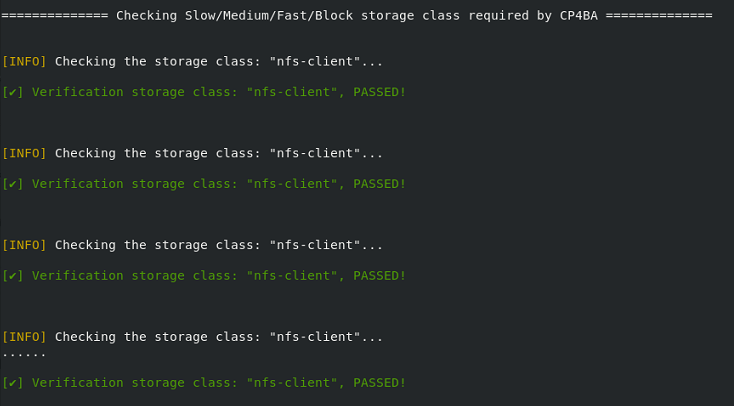
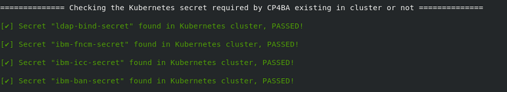
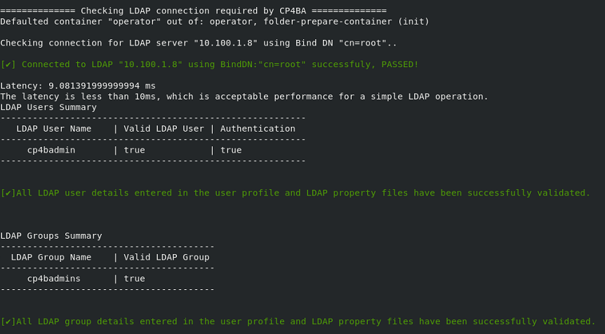

# Exercise 5: Generating the Prerequisites and Verifying Configuration

# 5.1 Introduction

In the last exercise, the configuration parameters in the property
files created by the `cp4a-prerequisites.sh` script, has been set to
the required values.  This is a required precondition for running the
`cp4a-prerequisites.sh` now in **generate** mode. In this mode, the
script will first review completeness of the configuration variables,
and will then generate the required Kubernetes secret definitions. If
a different database than the EDB Postgres would have been chosen,
then the script would as well create scripts for setting up the
databases on the selected database server(s).
In the verification section of this Exercise, the
`cp4a-prerequisites.sh` script is run in **validate mode**, to
validate the configuration and deployment of the prerequisites.

# 5.2 Exercise Instructions

1.	Switch to the **Terminal** window. Change to the **cert-kubernetes/scripts** directory.

    ```
    cd $HOME/cp4ba/cert-kubernetes/scripts
    ```

2.	Run the **cp4a-prerequisites.sh** script in **generate** mode. In this mode, information configured in the property files is reviewed, and the CP4BA Configuration files are generated. 

    ```
    ./cp4a-prerequisites.sh -m generate -n ibm-cp4ba
    ```

	If error messages are printed, get back to the last exercise and edit the two property files, to find any configuration value which still contains a `<required>` value.
	
    > Note When running it without parameters, the `cp4a-prerequisites.sh` script supplies a usage.
	
	> 
 
4.	The script does not ask for further input, in this mode. Result of checking the property files is indicated in green or red color, red color indicates errors or missing values. 

    Expected output:
	
	
 
 
5.	The next step is to apply the generated secrets. Thankfully the secrets are ready and don’t need manual updating, and there is even a shellscript 
    for defining them. 

    ```
    cd cp4ba-prerequisites/project/ibm-cp4ba
    ./create_secret.sh
    ```

    Expected output:	
	
	
    > **Note:** Most secrets are also documented in the Knowledge Center, but it might not always be straightforward to find them there. Mostly, the names of the secrets can also be changed through definitions in the custom resource. The default names for some of them furthermore includes the name of the custom resource.

## 5.3 Validation steps
 
In this section, the `cp4a-prerequisite.sh` is executed in validate mode. This is an optional step, but highly recommended to verify consistency of the specification, and check for common problems.

In an environment with separate LDAP and either separate database server(s) or using EDB Embedded Postgres, validation can be run successfully from the bastion host. However, if the database is running within the same Openshift cluster, then it might only be reachable from within the cluster, and it wouldnt be possible to check connectivity to it successfully from the bastion host. Also in an Air-Gapped environment, you might want to run the validation 
from inside the Openshift cluster, to check for any additional allowances to access the Database and LDAP Servers from the Openshift cluster.
To run the validation scripts from inside the Openshift cluster, it is required to setup a bastion pod inside the Openshift cluster. 

How a Bastion can be setup within the Openshift Cluster goes beyond what the Development team provides for CP4BA deployment with Version 25.0.0. An approach which can be used is discussed in the [Manual CP4BA Deployment Project of Apollo](https://github.com/apollo-business-automation/cp4ba-manual-deployment?tab=readme-ov-file#preparing-a-client-to-connect-to-the-cluster). 

 
1. Change back to the scripts directory. From there you can run the validation script.

    ```
    cd $HOME/cp4ba/cert-kubernetes/scripts
    ./cp4a-prerequisites.sh -m validate -n ibm-cp4ba
    ```
    
Review the generated output, it checks the storage class, ldap settings, username existence and the database settings. It also checks the latency of the connection to the LDAP Server, which will be useful in case the `cp4a-prerequisite.sh` script is run for verification from inside of the Openshift cluster.

3. Expected output of storage class checking:
 
    

    With errors in this step, check if the right storage class names were provided, and whether the storage class is defined, by running `oc get storageclass`. With any updates, it needed to update the configuration, by re-running the prerequisite script in generate mode, see beginning of this chapter for reference.

4. Expected output of secret checking

    
 
    With errors in this step, please check if the files with the Kubernetes secrets were correctly applied, see last step of preceding section for reference.

5. Expected output of LDAP connection speed testing
 
    
	
	With errors in this step, check if the SDS is running, and whether the correct IP address and port number were configured in the properties files. If SDS is not running, or not responding correctly, it can be restarted by running `sudo systemctl restart sds`. If configuration files need to be updated, generate the configuration again, apply the secrets, and rerun these verification steps. If *only* the latency is bad, this can be ignored in this sample environment. In a production environment of a customer, this would need to be investigated properly.
	
6. For the database, no checking is done, as we have selected Embedded EDB Postgres as database, and databases will be generated by the Operators as 
   part of the deployment process.
	
Congratulations, with completion of this exercise, the required prerequisites for the deployment of Cloud Pak For Business Automation should be in place. In the [next exercise](Exercise-6-Deploy-CP4BA.md), the case package script `cp4a-deployment.sh` is used to generate the so-called *CR* (shorthand for Custom Resource). Applying that YAML file to Kubernetes will kick-start the deployment of the Cloud Pak For Business Automation.
